## Enumeration

When running enumeration with nmap, we recognize that we are facing an Active Directory environment. Among the relevant details reported are the domain name `cascade.local` and little else.


In this case, HTB does not provide valid credentials for access, so we’ll have to find our own way in. When trying to list shared files, we’ll see there’s no access, so we’ll start enumerating the server to see what we can gather.

##### Listing users without valid credentials

To list users, we’ll use `nxc`; by passing null credentials, it will report the users on the server. Note that this is not always possible.

```bash
nxc 10.10.10.182 -u '' -p '' --users
```

This will give us a list of users.

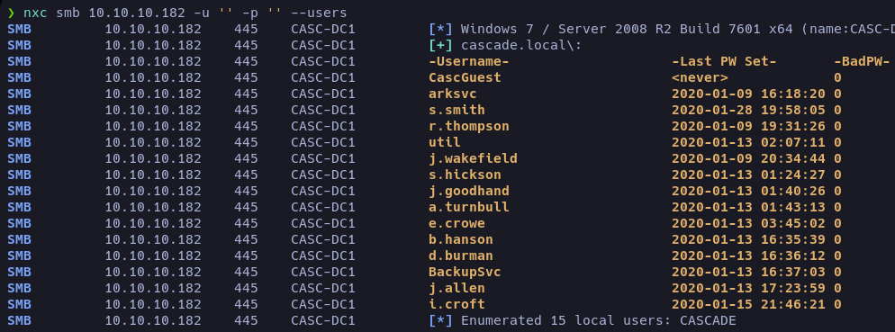

I always like to create a file with the listed users; later, for any script, it’s handy to have it.

```bash
nxc smb 10.10.10.182 -u '' -p '' --users | awk '{print$5}' | grep -v '\[' | sed '1d' > users
```

Now we have our list of users but… the password. This required some research, since I was just getting familiar with Active Directory environments. I found a pretty complete resource explaining LDAP enumeration well: [HERE](https://medium.com/@minimalist.ascent/pentesting-ldap-servers-25577bde675b).

To start, let’s make an LDAP query without credentials:

```bash
ldapsearch -x -H ldap://10.10.10.182 -b "DC=cascade,DC=local"
```

This returns a bunch of information I initially had no idea about. The blog showed that we could parse the output to find relevant info. Eventually, I noticed that one user had an extra entry — a Base64-encoded value we could decode.

```bash
while IFS= read -r line; do 
    ldapsearch -x -H ldap://10.10.10.182 -b "DC=cascade,DC=local" | grep -A10 "$line"| grep -v "dSCorePropagationData"
    echo -e "\n<--------------------->\n" 
done <users
```

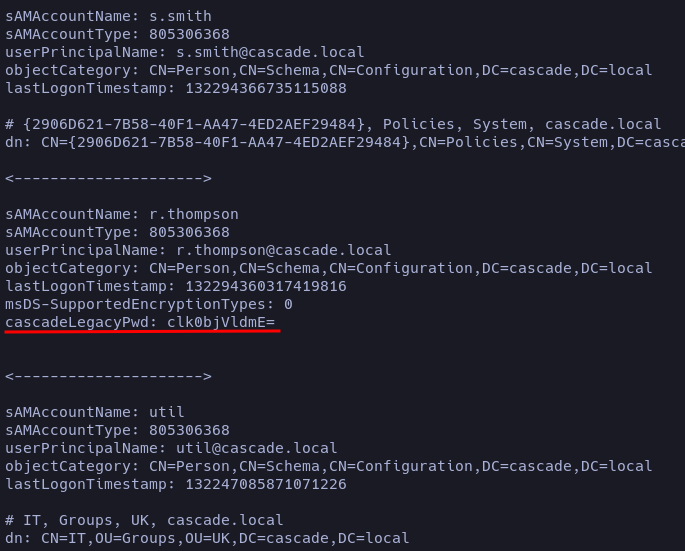

After decoding, I saw it was plaintext, so I used it as the credential for user `r.thompson`, and it worked. Unfortunately, this user doesn’t have remote access rights, but now we can list shared resources. 

While exploring (without going into too much detail), we find a share named `Data`, which seems to be the only one we can read. In the path _**Data/IT/Temp/s.smith**_ we can download the file [VNC Install.reg](# 'Text file containing Windows Registry keys and values; importing it modifies (adds/edits/deletes) system registry entries.').

#### Decrypting the VNC key

A quick online search led me to a VNC key decryptor — it uses default encryption keys to decrypt passwords. [Git](https://github.com/billchaison/VNCDecrypt)

```bash
echo -n 6bcf2a4b6e5aca0f | xxd -r -p | openssl enc -des-cbc --nopad --nosalt -K e84ad660c4721ae0 -iv 0000000000000000 -d -provider legacy -provider default | hexdump -Cv
```

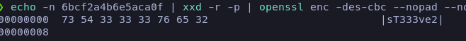

## Accessing as user Smith

With the password from the `.reg` file, we can assume it belongs to `s.smith`, so let’s check if that user has remote access.

```bash
nxc winrm 10.10.10.182 -u 's.smith' -p 'sT333ve2'
```

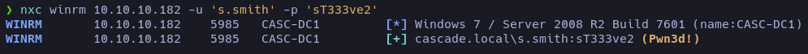

We’ll connect using [Evil-WinRm](# 'WinRM client used in pentesting: allows authentication against WinRM services on Windows machines to run commands, open remote shells, and transfer files with valid credentials.'). On the desktop, we’ll find our flag.

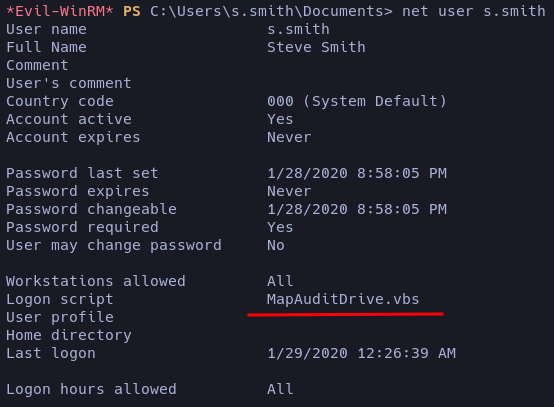

While enumerating `s.smith`, we find a script named `MapAuditDrive.vbs`. Let’s check shared resources for traces of this executable. 

Unlike `r.thompson`, `s.smith` does have access to the `Audit%` share.

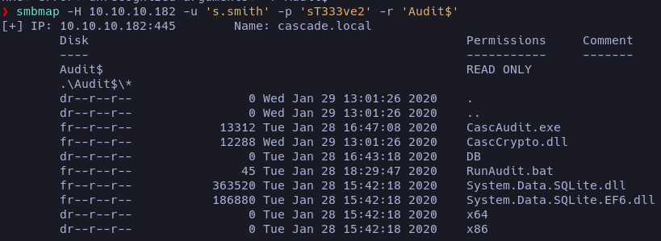

We download everything to later decompile with [ILSpy](# 'Reverse engineering tool for .NET that decompiles assemblies (DLL/EXE) and lets you explore their C# source code.') and reverse engineer the files `CascAudit.exe` and `CascCrypto.dll`.

## Analyzing CascAudit.exe

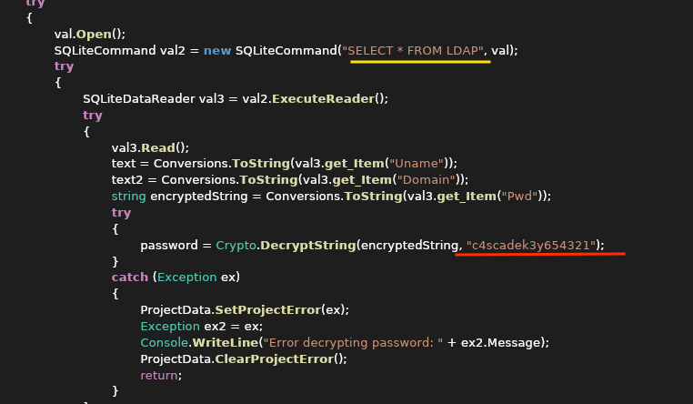

It selects a database named LDAP, and the password is being handled through a function named Crypto. But before that, let’s see what’s inside the LDAP table, since earlier we saw a directory named DB among the shared resources.

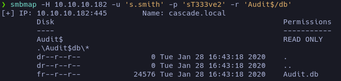

Inside the database, we find the key that decrypts the password, but we still don’t know how it was encrypted. We’ll need to analyze the remaining document to identify the encryption method and perform reverse engineering.

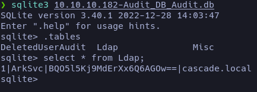

## Analyzing CascCrypto.dll

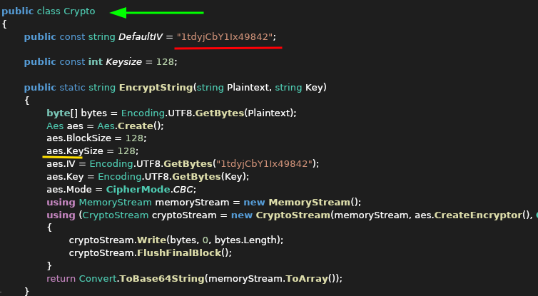

Here we get more relevant info; however, I still didn’t know what to do. After researching what [AES](# '(Advanced Encryption Standard): fast and secure symmetric block cipher widely used to protect data in transit and at rest.') was and experimenting in [CyberChef](# 'CyberChef: interactive web tool for analyzing, decoding, encrypting, or transforming data using chained “recipes” of operations.'), I realized I already had everything needed to decrypt the password. The recipe is simple:

- Decode from Base64.
- The key is _c4scadek3y654321_ in UTF-8.
- The IV is _1tdyjCbY1Ix49842_ also in UTF-8.

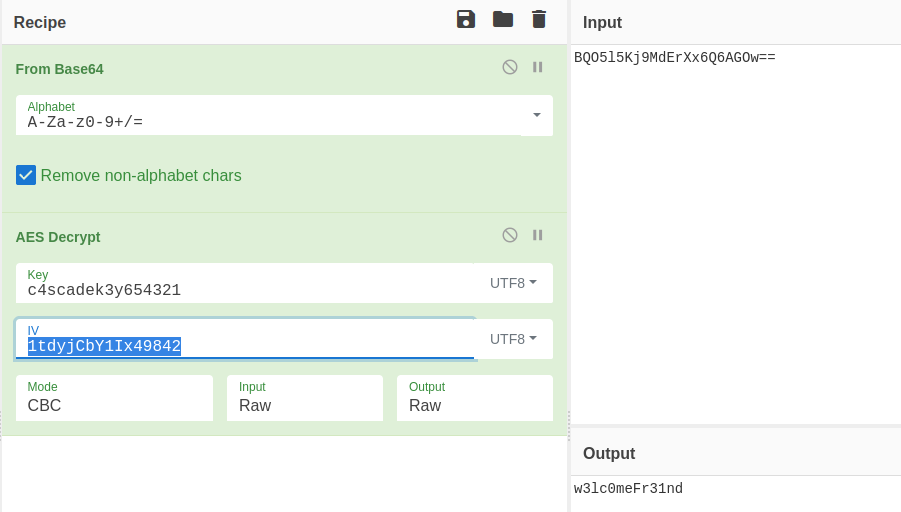

## Root flag

Now we have the password for user `ArkSvc` and remote access rights.

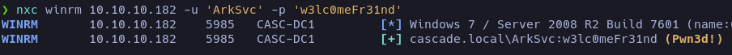

I thought we had reached the final flag, but no — we still needed to escalate to the Administrator account. At first, I was a bit lost, but while checking the shared resources, in _Meeting_Notes_June_2018.html_ we find a clue saying a temporary account was used that had the same password as the Administrator. Now… how do we find that?

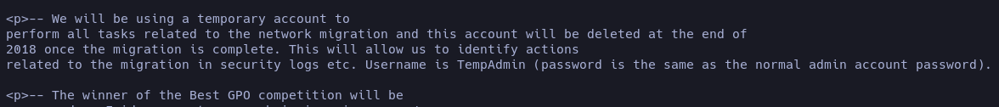

On the official [Windows](https://learn.microsoft.com/en-us/powershell/module/activedirectory/get-adobject?view=windowsserver2025-ps&utm_source=chatgpt.com) site, we can start crafting a PowerShell command to look into the Recycle Bin and see if we can recover that password.

```powershell
Get-ADObject -ldapfilter "(&(ObjectClass=user)(DisplayName=TempAdmin)(isDeleted=TRUE))" -IncludeDeletedObjects -Properties *
```

This query returns an object with a Base64 value containing the key.

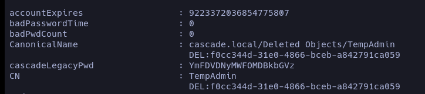

On the desktop, we’ll find the RootFlag.

# END
