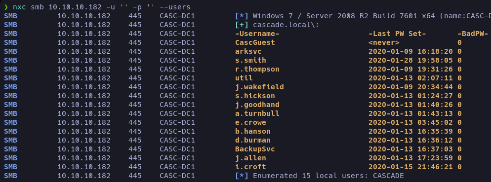
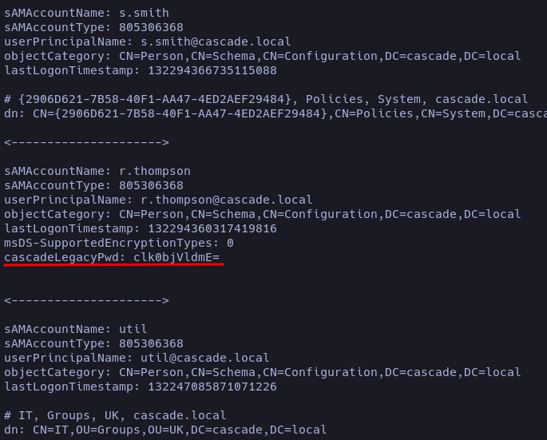
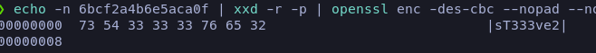
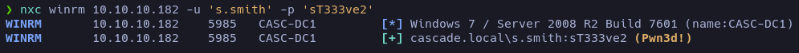
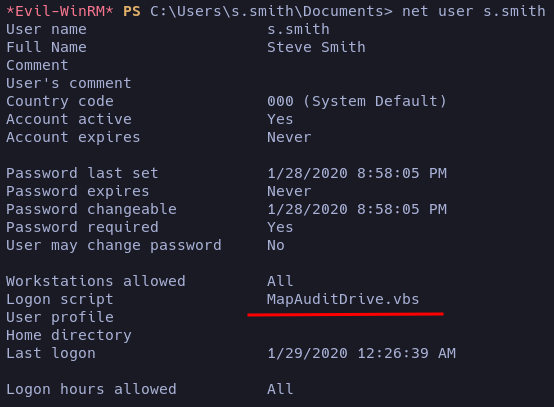
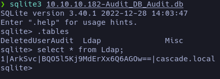
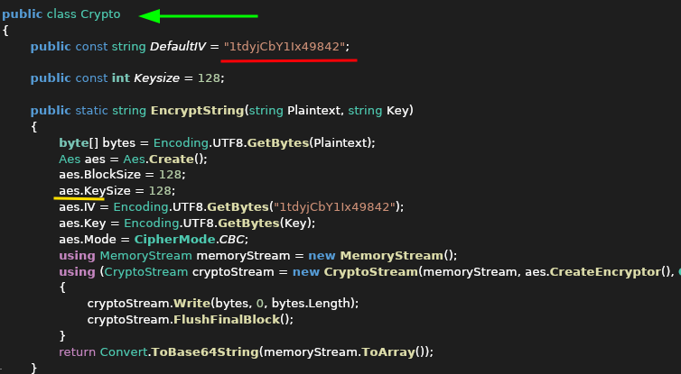
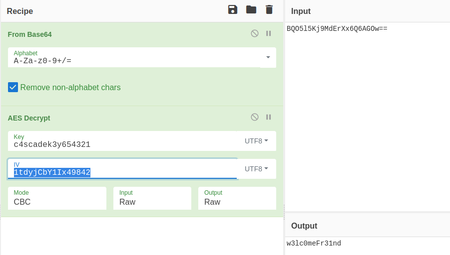
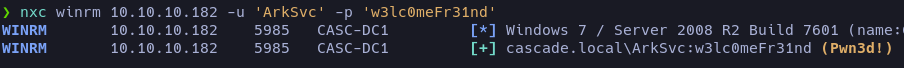

## Enumeración

Al ejecutar la enumeración con nmap, reconocemos que estamos frente a un directorio activo; entre las cosas relevantes que nos reporta están el nombre del dominio `cascade.local` y pocas cosas más.


En esta ocasión HTB no nos da credenciales válidas para acceder, así que tendremos que buscarnos la vida para entrar. Al intentar listar archivos compartidos, veremos que no hay acceso, así que no nos queda otra que empezar a enumerar el servidor a ver qué podemos rascar.

##### Listando usuarios sin credenciales válidas.

Para listar los usuarios usaremos nxc; pasándole credenciales nulas nos reportará los usuarios que hay en el servidor. Cabe aclarar que no siempre es posible.

```bash
nxc 10.10.10.182 -u '' -p '' --users
```

Esto nos dará un listado de usuarios.



Siempre me gusta hacer un archivo con los usuarios listados; luego, para cualquier script, es bueno tenerlo.

```bash
nxc smb 10.10.10.182 -u '' -p '' --users     | awk '{print$5}' | grep -v '\[' 
    | sed '1d' > users
```

Ya tenemos nuestra lista de usuarios pero... el password. Esto me llevó un poco de investigación, ya que hasta ahora me empecé a familiarizar con entornos de directorio activo. Encontré un recurso bastante completo que te explica muy bien la enumeración con LDAP. [AQUI](https://medium.com/@minimalist.ascent/pentesting-ldap-servers-25577bde675b).

Para empezar, hagamos la consulta LDAP sin necesidad de pasar credenciales.

```bash
ldapsearch -x -H ldap://10.10.10.182 -b "DC=cascade,DC=local"
```

Esto nos va a devolver una cantidad de cosas que personalmente no tenía ni idea de lo que eran. En el blog vi que podíamos enumerar el archivo buscando información relevante; me costó darme cuenta, pero vi que había un usuario que tenía una entrada que los demás no tenían: devolvía un valor en base64 que podemos decodificar.

```bash
while IFS= read -r line; do 
    ldapsearch -x -H ldap://10.10.10.182 -b "DC=cascade,DC=local" | grep -A10 "$line"| grep -v "dSCorePropagationData"
    echo -e "\n<--------------------->\n" 
done <users
```



Al decodificarlo vi que estaba en texto claro, así que la usé como credencial para el usuario r.thompson y, efectivamente, era su password. Desgraciadamente no tiene permisos de acceso remoto, pero ya podemos listar recursos compartidos. 

Al estar explorando (y sin extenderme en esto) nos encontramos con el recurso llamado `Data`, que parece ser el único al que tenemos permisos de lectura. En la ruta _**Data/IT/Temp/s.smith**_ podremos descargar el archivo [VNC Install.reg](# 'Archivo de texto que contiene claves y valores del Registro de Windows; al importarlo modifica (añade/edita/elimina) entradas del registro del sistema.').

#### Desencriptando la clave VNC

Haciendo una búsqueda rápida en internet, no me costó encontrar un desencriptador de claves VNC; utiliza claves de cifrado predeterminadas y las desencripta. [Git](https://github.com/billchaison/VNCDecrypt)

```bash
 echo -n 6bcf2a4b6e5aca0f | xxd -r -p |     openssl enc -des-cbc --nopad --nosalt -K e84ad660c4721ae0     -iv 0000000000000000 -d -provider legacy -provider default |    hexdump -Cv
```



## Accediendo como el usuario Smith 

Teniendo la clave del archivo .reg, podemos intuir que es del usuario s.smith, así que veamos si tiene acceso remoto a la máquina.

```bash
nxc winrm 10.10.10.182 -u 's.smith' -p 'sT333ve2'
```



Entraremos usando [Evil-WinRm](# 'Cliente de WinRM usado en pentesting: permite autenticarse contra servicios WinRM en máquinas Windows para ejecutar comandos, abrir shells remotos y transferir archivos con credenciales.'). En el escritorio encontraremos nuestra flag.



Enumerando al usuario s.smith podemos encontrarnos con que está corriendo un script llamado `MapAuditDrive.vbs`. Veamos los recursos compartidos a ver si podemos encontrar indicios de este ejecutable. 

A diferencia de r.thompson, s.smith sí tiene acceso al recurso `Audit%`.


Nos descargamos todo, que luego desensamblaremos con [ILSpy](# 'Herramienta de ingeniería inversa para .NET que permite decompilar ensamblados (DLL/EXE) y explorar su código fuente en C#.'), y aplicaremos ingeniería inversa a los archivos `CascAudit.exe` y `CascCrypto.dll`.

## Analizando CascAudit.exe


Está seleccionando una base de datos llamada LDAP y la _password_ está pasando llamando a una función llamada Crypto. Pero antes de eso, veamos qué hay en la tabla LDAP, ya que antes, cuando listamos los recursos compartidos, vi que había un directorio llamado DB.


Dentro de la base de datos nos encontraremos la clave que desencripta la contraseña, pero aún no sabemos cómo está encriptada ni nada. Tendremos que investigar el otro documento que nos falta para ver si nos refleja información de qué cifrado usó y ver si podemos hacer la ingeniería inversa.



## Analizando CascCrypto.dll




Aquí ya tenemos información más relevante; sin embargo, seguía sin saber qué hacer. Buscando qué era [AES](# '(Advanced Encryption Standard): algoritmo de cifrado simétrico por bloques, rápido y seguro, usado ampliamente para proteger datos en tránsito y en reposo.') y probando en [CyberChef](# 'CyberChef: herramienta web interactiva para analizar, decodificar, cifrar o transformar datos mediante “recetas” de operaciones encadenadas.') cómo se descifra, vi que ya tenía todo lo necesario para poder desencriptar la password. La receta es simple:

- Hay que decodificarlo de Base64.
- La key es _c4scadek3y654321_ en UTF-8.
- Y el IV sería 1tdyjCbY1Ix49842 también en UTF-8.




## Root flag

Ya tenemos la password del usuario ArkSvc y permisos de acceso remoto.



Pensé que ya habíamos llegado a tener la flag, pero no; aún tenemos que seguir buscando a ver cómo podemos llegar a la cuenta administrador. Así que por un momento me sentí bastante perdido; entonces me puse a mirar los recursos compartidos y en el recurso _Meeting_Notes_June_2018.html_ nos dan la pista de que se estuvo usando una cuenta temporal que tenía la misma contraseña que la del administrador. Ahora... ¿cómo se hace eso?


En la página oficial de [Windows](https://learn.microsoft.com/en-us/powershell/module/activedirectory/get-adobject?view=windowsserver2025-ps&utm_source=chatgpt.com) podemos empezar a craftear nuestro código para buscar en la papelera, a ver si encontramos la contraseña.

- Get-ADObject -ldapfilter "(&(ObjectClass=user)(DisplayName=TempAdmin)(isDeleted=TRUE))" -IncludeDeletedObjects -Properties *

Esto nos devolverá el valor de la consulta donde encontraremos la clave en base64.


En el escritorio encontraremos la RootFlag.


# FIN 
